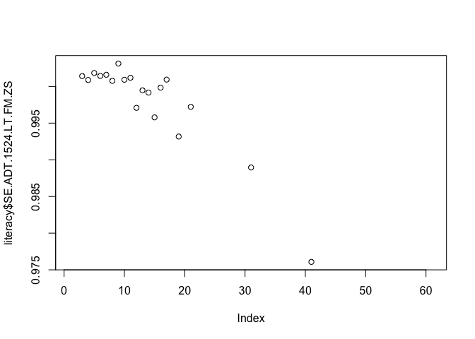
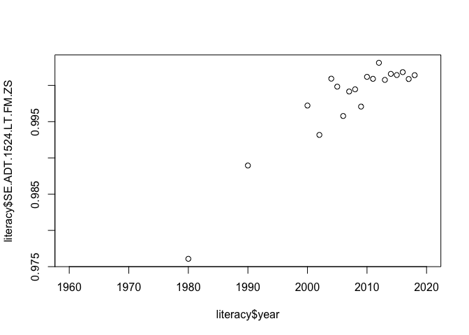
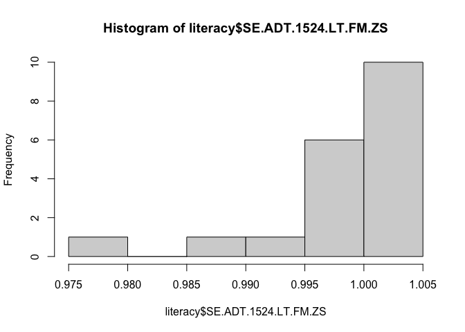
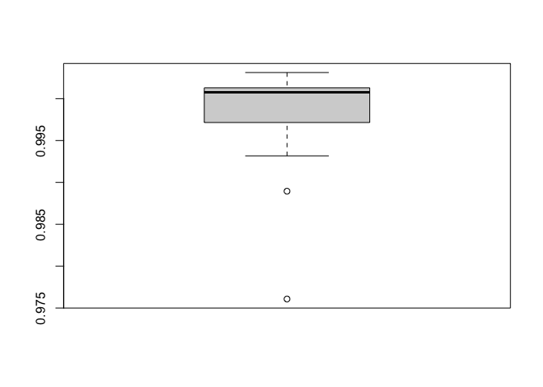

Práctica 1. Introducción
================
Ana Escoto
09/02/2021

# Primer acercamiento al uso del programa

En RStudio podemos tener varias ventanas que nos permiten tener más
control de nuestro “ambiente”, el historial, los “scripts” o códigos que
escribimos y por supuesto, tenemos nuestra consola, que también tiene el
símbolo “\>” con R. Podemos pedir operaciones básicas

``` r
2+5
```

    ## [1] 7

``` r
5*3
```

    ## [1] 15

``` r
#Para escribir comentarios y que no los lea como operaciones ponemos el símbolo de gato
# Lo podemos hacer para un comentario en una línea o la par de una instrucción
1:5               # Secuencia 1-5
```

    ## [1] 1 2 3 4 5

``` r
seq(1, 10, 0.5)   # Secuencia con incrementos diferentes a 1
```

    ##  [1]  1.0  1.5  2.0  2.5  3.0  3.5  4.0  4.5  5.0  5.5  6.0  6.5  7.0  7.5  8.0
    ## [16]  8.5  9.0  9.5 10.0

``` r
c('a','b','c')  # Vector con caracteres
```

    ## [1] "a" "b" "c"

``` r
1:7             # Entero
```

    ## [1] 1 2 3 4 5 6 7

``` r
40<80           # Valor logico
```

    ## [1] TRUE

``` r
2+2 == 5        # Valor logico
```

    ## [1] FALSE

``` r
T == TRUE       # T expresion corta de verdadero
```

    ## [1] TRUE

R es un lenguaje de programación por objetos. Por lo cual vamos a tener
objetos a los que se les asigna su contenido. Si usamos una flechita
“\<-” o “-\>” le estamos asignando algo al objeto que apunta la
felcha.

``` r
x <- 24         # Asignacion de valor 24 a la variable x para su uso posterior (OBJETO)
x/2             # Uso posterior de variable u objeto x
```

    ## [1] 12

``` r
x               # Imprime en pantalla el valor de la variable u objeto
```

    ## [1] 24

``` r
x <- TRUE       # Asigna el valor logico TRUE a la variable x OJO: x toma el ultimo valor que se le asigna
x
```

    ## [1] TRUE

## Vectores

Los vectores son uno de los objetos más usados en R.

``` r
y <- c(2,4,6)     # Vector numerico
y <- c('Primaria', 'Secundaria') # Vector caracteres
```

Dado que poseen elementos, podemos también observar y hacer operaciones
con sus elementos, usando “\[ \]” para acceder a ellos

``` r
y[2]              # Acceder al segundo valor del vector y
```

    ## [1] "Secundaria"

``` r
y[3] <- 'Preparatoria y más' # Asigna valor a la tercera componente del vector
sex <-1:2         # Asigna a la variable sex los valores 1 y 2
names(sex) <- c("Femenino", "Masculino") # Asigna nombres al vector de elementos sexo
sex[2]            # Segundo elemento del vector sex
```

    ## Masculino 
    ##         2

## Matrices

Las matrices son muy importantes, porque nos permiten hacer operaciones
y casi todas nuestras bases de datos tendran un aspecto de matriz.

``` r
m <- matrix (nrow=2, ncol=3, 1:6, byrow = TRUE) # Matrices Ejemplo 1
m
```

    ##      [,1] [,2] [,3]
    ## [1,]    1    2    3
    ## [2,]    4    5    6

``` r
m <- matrix (nrow=2, ncol=3, 1:6, byrow = FALSE) # Matrices Ejemplo 1
m
```

    ##      [,1] [,2] [,3]
    ## [1,]    1    3    5
    ## [2,]    2    4    6

``` r
dim(m)
```

    ## [1] 2 3

``` r
attributes(m)
```

    ## $dim
    ## [1] 2 3

``` r
n <- 1:6     # Matrices Ejemplo 2
dim(n) <- c(2,3)
n
```

    ##      [,1] [,2] [,3]
    ## [1,]    1    3    5
    ## [2,]    2    4    6

``` r
xx <-10:12   # Matrices Ejemplo 3
yy<-14:16
cbind(xx,yy) # Une vectores por Columnas
```

    ##      xx yy
    ## [1,] 10 14
    ## [2,] 11 15
    ## [3,] 12 16

``` r
rbind(xx,yy) # Une vectores por Renglones
```

    ##    [,1] [,2] [,3]
    ## xx   10   11   12
    ## yy   14   15   16

``` r
mi_matrix<-cbind(xx,yy) # este resultado lo puedo asignar a un objeto
```

## Funciones

Algunas funciones básicas son las siguientes. Vamos a ir viendo más
funciones, pero para entender cómo funcionan, haremos unos ejemplos y
cómo pedir ayuda sobre ellas.

``` r
sum (10,20,30)    # Función suma
```

    ## [1] 60

``` r
rep('R', times=3) # Repite la letra R el numero de veces que se indica
```

    ## [1] "R" "R" "R"

``` r
sqrt(9)           # Raiz cuadrada de 9
```

    ## [1] 3

## Ayuda

Pedir ayuda es indispensable para aprender a escribir nuestros códigos.
A prueba y error, es el mejor sistema para aprender. Podemos usar la
función help, example y ?

``` r
help(sum)         # Ayuda sobre función sum
example(sum)      # Ejemplo de función sum
```

    ## 
    ## sum> ## Pass a vector to sum, and it will add the elements together.
    ## sum> sum(1:5)
    ## [1] 15
    ## 
    ## sum> ## Pass several numbers to sum, and it also adds the elements.
    ## sum> sum(1, 2, 3, 4, 5)
    ## [1] 15
    ## 
    ## sum> ## In fact, you can pass vectors into several arguments, and everything gets added.
    ## sum> sum(1:2, 3:5)
    ## [1] 15
    ## 
    ## sum> ## If there are missing values, the sum is unknown, i.e., also missing, ....
    ## sum> sum(1:5, NA)
    ## [1] NA
    ## 
    ## sum> ## ... unless  we exclude missing values explicitly:
    ## sum> sum(1:5, NA, na.rm = TRUE)
    ## [1] 15

## Mi ambiente

Todos los objetos que hemos declarado hasta ahora son parte de nuestro
“ambiente” (environment). Para saber qué está en nuestro ambiente
usamos el comando

``` r
ls()
```

    ## [1] "m"         "mi_matrix" "n"         "sex"       "x"         "xx"       
    ## [7] "y"         "yy"

``` r
gc()           # Garbage collection, reporta memoria en uso
```

    ##          used (Mb) gc trigger (Mb) limit (Mb) max used (Mb)
    ## Ncells 444080 23.8     939747 50.2         NA   658105 35.2
    ## Vcells 846376  6.5    8388608 64.0      16384  1802056 13.8

Para borrar todos nuestros objetos, usamos el siguiente comando, que
equivale a usar la escobita de la venta de environment

``` r
rm(list=ls())  # Borrar objetos actuales
```

## Directorio de trabajo

Es muy útil saber dónde estamos trabajando y donde queremos trabajar.
Por eso podemos utilizar los siguientes comandos para saberlo

Ojo, checa, si estás desdes una PC, cómo cambian las “" por”/" o por
“\\”

``` r
getwd()           # Directorio actual
```

    ## [1] "/Users/anaescoto/Dropbox/2021/MEG/repo-MEG"

``` r
#setwd()
list.files()      # Lista de archivos en ese directorio
```

    ## [1] "_config.yml"  "datos"        "LICENSE"      "P1.html"      "P1.Rmd"      
    ## [6] "programa.pdf" "README.md"

Checar que esto también se puede hacer desde el menú: Session –\> Set
Working Directory –\> Choose

## Proyectos

Pero… a veces preferimos trabajar en proyectos, sobre todo porque nos da
más control.

Hay gente que lo dice mejor que yo, como Hadley Wickham:
<https://es.r4ds.hadley.nz/flujo-de-trabajo-proyectos.html>

# Instalación de librerías

Las librerías son útiles para realizar funciones especiales. La
especialización de paquetes es más rápida en R que en otros programas
por ser un software libre.

Vamos a instalar el paquete “foreign”, como su nombre lo indica, nos
permite leer elementos “extranjeros” en R. Es sumamente útil porque nos
permite leer casi todos los formatos, sin necesidad de usar paquetes
especializados como <i>StatTransfer</i>.

Para instalar las paqueterías usamos el siguiente comando
“install.packages()” Checa que adentro del paréntesis va el nombre de
la librería, con comillas.

Con la opción “dependencies = TRUE” R nos instalará no sólo la librería
o paquete que estamos pidiendo, sino todo aquellos paquetes que necesite
la librería en cuestión. Muchas veces los diseños de los paquetes
implican el uso de algún otro anterior. Por lo que poner esta sentencia
nos puede ahorrar errores cuando estemos usando el paquete. Piensa que
esto es similar a cuando enciendes tu computadora y tu sistema operativo
te pide que mantengas las actualizaciones.

Vamos a instalar dos librerías que nos permiten importar formatos.

``` r
#install.packages("foreign", dependencies = TRUE)
#install.packages("haven", dependencies = TRUE)
```

Este proceso no hay que hacerlo siempre. Si no sólo la primera vez. Una
vez instalado un paquete de librería, la llamamos con el comando
“library”

``` r
library(foreign)
library(haven)
```

“foreing” nos permite leer archivos en formato de dBase, con extensión
“.dbf”. Si bien no es un formato muy común para los investigadores, sí
para los que generan la información, puesto que dBase es uno de los
principales programas de administración de bases de datos.

He puesto un ejemplo de una base de datos mexicana en dbf, en este
formato.

``` r
tsdem<-read.dbf("./datos/ENVIPE2020/TSDem.dbf") #checa cómo nos vamos adentro de nuestro directorio
```

# Dataframes

Vamos a instalar la librería “WDI” que nos da acceso a un grupo amplio
de bases de datos que nos ayudaran a revisar y analizar algunas técnicas
sencillas.

``` r
#install.packages("WDI", dependencies = TRUE)
library(WDI)
```

“El Banco Mundial pone a disposición una gran cantidad de datos
excelentes de los Indicadores de Desarrollo Mundial a través de su API
web. El paquete WDI para R facilita la búsqueda y descarga de series de
datos desde WDI”.

``` r
WDIsearch('gender')
```

    ##        indicator                                  
    ##   [1,] "2.3_GIR.GPI"                              
    ##   [2,] "2.6_PCR.GPI"                              
    ##   [3,] "5.51.01.07.gender"                        
    ##   [4,] "BI.EMP.PWRK.PB.FE.ZS"                     
    ##   [5,] "BI.EMP.PWRK.PB.MA.ZS"                     
    ##   [6,] "BI.EMP.TOTL.PB.FE.ZS"                     
    ##   [7,] "BI.EMP.TOTL.PB.MA.ZS"                     
    ##   [8,] "BI.WAG.PREM.PB.FE"                        
    ##   [9,] "BI.WAG.PREM.PB.MA"                        
    ##  [10,] "FB.FCP.BREG.PR.DI.SC"                     
    ##  [11,] "IC.REG.PRRT.LNDADM.GEN.XD.030.DB1719.DFRN"
    ##  [12,] "IQ.CPA.GNDR.XQ"                           
    ##  [13,] "PRJ.MYS.15UP.GPI"                         
    ##  [14,] "PRJ.MYS.25UP.GPI"                         
    ##  [15,] "SE.ADT.1524.LT.FM.ZS"                     
    ##  [16,] "SE.ENR.PRIM.FM.ZS"                        
    ##  [17,] "SE.ENR.PRSC.FM.ZS"                        
    ##  [18,] "SE.ENR.SECO.FM.ZS"                        
    ##  [19,] "SE.ENR.TERT.FM.ZS"                        
    ##  [20,] "SG.LAW.CRDD.GR"                           
    ##  [21,] "SG.LAW.NODC.HR"                           
    ##  [22,] "SG.NOD.CONS"                              
    ##  [23,] "UIS.AIR.1.Glast.GPI"                      
    ##  [24,] "UIS.AIR.1.GPI"                            
    ##  [25,] "UIS.AIR.2.GPV.GLAST.GPI"                  
    ##  [26,] "UIS.AIR.2.GPV.GPI"                        
    ##  [27,] "UIS.EA.1T6.AG25T99.GPI"                   
    ##  [28,] "UIS.EA.2T6.AG25T99.GPI"                   
    ##  [29,] "UIS.EA.3T6.AG25T99.GPI"                   
    ##  [30,] "UIS.EA.4T6.AG25T99.GPI"                   
    ##  [31,] "UIS.EA.5T8.AG25T99.GPI"                   
    ##  [32,] "UIS.EA.6T8.AG25T99.GPI"                   
    ##  [33,] "UIS.EA.7T8.AG25T99.GPI"                   
    ##  [34,] "UIS.EA.8.AG25T99.GPI"                     
    ##  [35,] "UIS.ECDP.1.GPI"                           
    ##  [36,] "UIS.GER.0.GPI"                            
    ##  [37,] "UIS.GER.01.GPI"                           
    ##  [38,] "UIS.GER.02.GPI"                           
    ##  [39,] "UIS.GER.12.GPI"                           
    ##  [40,] "UIS.GER.1t6.GPI"                          
    ##  [41,] "UIS.GER.2.GPI"                            
    ##  [42,] "UIS.GER.3.GPI"                            
    ##  [43,] "UIS.GER.4.GPI"                            
    ##  [44,] "UIS.GGR.1.GPI"                            
    ##  [45,] "UIS.GGR.2.GPI"                            
    ##  [46,] "UIS.GGR.5.A.GPI"                          
    ##  [47,] "UIS.LR.AG15T99.GPI"                       
    ##  [48,] "UIS.LR.AG25T64.GPI"                       
    ##  [49,] "UIS.LR.AG65.GPI"                          
    ##  [50,] "UIS.NAR.1.GPIA"                           
    ##  [51,] "UIS.NAR.1.Q1.GPIA"                        
    ##  [52,] "UIS.NAR.1.Q2.GPIA"                        
    ##  [53,] "UIS.NAR.1.Q3.GPIA"                        
    ##  [54,] "UIS.NAR.1.Q4.GPIA"                        
    ##  [55,] "UIS.NAR.1.Q5.GPIA"                        
    ##  [56,] "UIS.NAR.1.RUR.GPIA"                       
    ##  [57,] "UIS.NAR.1.URB.GPIA"                       
    ##  [58,] "UIS.NAR.2.GPIA"                           
    ##  [59,] "UIS.NAR.2.Q1.GPIA"                        
    ##  [60,] "UIS.NAR.2.Q2.GPIA"                        
    ##  [61,] "UIS.NAR.2.Q3.GPIA"                        
    ##  [62,] "UIS.NAR.2.Q4.GPIA"                        
    ##  [63,] "UIS.NAR.2.Q5.GPIA"                        
    ##  [64,] "UIS.NAR.2.RUR.GPIA"                       
    ##  [65,] "UIS.NAR.2.URB.GPIA"                       
    ##  [66,] "UIS.NART.2.GPIA"                          
    ##  [67,] "UIS.NART.2.Q1.GPIA"                       
    ##  [68,] "UIS.NART.2.Q2.GPIA"                       
    ##  [69,] "UIS.NART.2.Q3.GPIA"                       
    ##  [70,] "UIS.NART.2.Q4.GPIA"                       
    ##  [71,] "UIS.NART.2.Q5.GPIA"                       
    ##  [72,] "UIS.NART.2.RUR.GPIA"                      
    ##  [73,] "UIS.NART.2.URB.GPIA"                      
    ##  [74,] "UIS.NER.02.GPI"                           
    ##  [75,] "UIS.NER.1.GPI"                            
    ##  [76,] "UIS.NER.23.GPI"                           
    ##  [77,] "UIS.NERA.1.GPI"                           
    ##  [78,] "UIS.NERA.2.GPI"                           
    ##  [79,] "UIS.NERA.3.GPI"                           
    ##  [80,] "UIS.NERT.1.GPI"                           
    ##  [81,] "UIS.NERT.2.GPI"                           
    ##  [82,] "UIS.NERT.3.GPI"                           
    ##  [83,] "UIS.NIR.1.AGM1.GPI"                       
    ##  [84,] "UIS.NIR.1.AGP1.GPI"                       
    ##  [85,] "UIS.NIR.1.GPI"                            
    ##  [86,] "UIS.NIRA.1.GPI"                           
    ##  [87,] "UIS.REPP.1.GPI"                           
    ##  [88,] "UIS.REPP.2.GPV.GPI"                       
    ##  [89,] "UIS.SLE.02.GPI"                           
    ##  [90,] "UIS.SLE.1.GPI"                            
    ##  [91,] "UIS.SLE.123.GPI"                          
    ##  [92,] "UIS.SLE.1t6.GPI"                          
    ##  [93,] "UIS.SLE.23.GPI"                           
    ##  [94,] "UIS.SLE.4.GPI"                            
    ##  [95,] "UIS.SLE.56.GPI"                           
    ##  [96,] "UIS.SLEN.12.GPI"                          
    ##  [97,] "UIS.SR.1.G4.GPI"                          
    ##  [98,] "UIS.SR.1.G5.GPI"                          
    ##  [99,] "UIS.SR.1.GLAST.GPI"                       
    ## [100,] "UIS.SR.2.GPV.GLAST.GPI"                   
    ## [101,] "UIS.TRANRA.23.GPV.GPI"                    
    ## [102,] "UIS.TRTP.02.GPI"                          
    ## [103,] "UIS.TRTP.1.GPI"                           
    ## [104,] "UIS.TRTP.2.GPI"                           
    ## [105,] "UIS.TRTP.23.GPI"                          
    ## [106,] "UIS.TRTP.3.GPI"                           
    ## [107,] "UIS.TRTP.4.GPI"                           
    ##        name                                                                                                                                                           
    ##   [1,] "Gender parity index for gross intake ratio in grade 1"                                                                                                        
    ##   [2,] "Gender parity index for primary completion rate "                                                                                                             
    ##   [3,] "Gender equality"                                                                                                                                              
    ##   [4,] "Public sector employment as a share of paid employment by gender (Female)"                                                                                    
    ##   [5,] "Public sector employment as a share of paid employment by gender (Male)"                                                                                      
    ##   [6,] "Public sector employment as a share of total employment by gender (Female)"                                                                                   
    ##   [7,] "Public sector employment as a share of total employment by gender (Male)"                                                                                     
    ##   [8,] "Public sector wage premiums by gender (Female) (compared to all private employees) (%)"                                                                       
    ##   [9,] "Public sector wage premiums by gender (Male) (compared to all private employees) (%)"                                                                         
    ##  [10,] "589_Do laws and regulations prohibit or restrict discriminating consumers based on gender, ethnicity, faith, political affiliation, or appearance?  _#VHGA_03"
    ##  [11,] "Registering property: Quality of land administration index with Gender (0-30) (DB17-19 methodology) - Score"                                                  
    ##  [12,] "CPIA gender equality rating (1=low to 6=high)"                                                                                                                
    ##  [13,] "Wittgenstein Projection: Mean Years of Schooling. Age 15+. Gender Gap"                                                                                        
    ##  [14,] "Wittgenstein Projection: Mean Years of Schooling. Age 25+. Gender Gap"                                                                                        
    ##  [15,] "Literacy rate, youth (ages 15-24), gender parity index (GPI)"                                                                                                 
    ##  [16,] "School enrollment, primary (gross), gender parity index (GPI)"                                                                                                
    ##  [17,] "School enrollment, primary and secondary (gross), gender parity index (GPI)"                                                                                  
    ##  [18,] "School enrollment, secondary (gross), gender parity index (GPI)"                                                                                              
    ##  [19,] "School enrollment, tertiary (gross), gender parity index (GPI)"                                                                                               
    ##  [20,] "The law prohibits discrimination in access to credit based on gender (1=yes; 0=no)"                                                                           
    ##  [21,] "Law prohibits discrimination in employment based on gender (1=yes; 0=no)"                                                                                     
    ##  [22,] "Nondiscrimination clause mentions gender in the constitution (1=yes; 0=no)"                                                                                   
    ##  [23,] "Primary completion rate, gender parity index (GPI)"                                                                                                           
    ##  [24,] "Gross intake ratio to Grade 1 of primary education, gender parity index (GPI)"                                                                                
    ##  [25,] "Lower secondary completion rate, gender parity index (GPI)"                                                                                                   
    ##  [26,] "Gross intake ratio to Grade 1 of lower secondary general education, gender parity index (GPI)"                                                                
    ##  [27,] "UIS: Percentage of population age 25+ with at least completed primary education (ISCED 1 or higher). Gender Parity Index"                                     
    ##  [28,] "UIS: Percentage of population age 25+ with at least completed lower secondary education (ISCED 2 or higher). Gender Parity Index"                             
    ##  [29,] "UIS: Percentage of population age 25+ with at least completed upper secondary education (ISCED 3 or higher). Gender Parity Index"                             
    ##  [30,] "UIS: Percentage of population age 25+ with at least completed post-secondary education (ISCED 4 or higher). Gender Parity Index"                              
    ##  [31,] "UIS: Percentage of population age 25+ with at least a completed short-cycle tertiary degree (ISCED 5 or higher). Gender Parity Index"                         
    ##  [32,] "UIS: Percentage of population age 25+ with at least a completed bachelor's or equivalent degree (ISCED 6 or higher). Gender Parity Index"                     
    ##  [33,] "UIS: Percentage of population age 25+ with at least a completed master's degree or equivalent (ISCED 7 or higher). Gender Parity Index"                       
    ##  [34,] "UIS: Percentage of population age 25+ with a doctoral degree or equivalent (ISCED 8). Gender Parity Index"                                                    
    ##  [35,] "Percentage of new entrants to Grade 1 of primary education with early childhood education experience, gender parity index (GPI)"                              
    ##  [36,] "Gross enrolment ratio, pre-primary, gender parity index (GPI)"                                                                                                
    ##  [37,] "Gross enrolment ratio, early childhood educational development programmes, gender parity index (GPI)"                                                         
    ##  [38,] "Gross enrolment ratio, pre-primary, gender parity index (GPI)"                                                                                                
    ##  [39,] "Gross enrolment ratio, primary and lower secondary, gender parity index (GPI)"                                                                                
    ##  [40,] "Gross enrolment ratio, primary to tertiary, gender parity index (GPI)"                                                                                        
    ##  [41,] "Gross enrolment ratio, lower secondary, gender parity index (GPI)"                                                                                            
    ##  [42,] "Gross enrolment ratio, upper secondary, gender parity index (GPI)"                                                                                            
    ##  [43,] "Gross enrolment ratio, post-secondary non-tertiary, gender parity index (GPI)"                                                                                
    ##  [44,] "Gross graduation ratio from primary education, gender parity index (GPI)"                                                                                     
    ##  [45,] "Gross graduation ratio from lower secondary education, gender parity index (GPI)"                                                                             
    ##  [46,] "Gross graduation ratio from first degree programmes (ISCED 6 and 7) in tertiary education, gender parity index (GPI)"                                         
    ##  [47,] "Adult literacy rate, population 15+ years, gender parity index (GPI)"                                                                                         
    ##  [48,] "Literacy rate, population 25-64 years, gender parity index (GPI)"                                                                                             
    ##  [49,] "Elderly literacy rate, population 65+ years, gender parity index (GPI)"                                                                                       
    ##  [50,] "UIS: Net attendance rate, primary, adjusted gender parity index (GPIA)"                                                                                       
    ##  [51,] "UIS: Net attendance rate, primary, poorest quintile, adjusted gender parity index (GPIA)"                                                                     
    ##  [52,] "UIS: Net attendance rate, primary, second quintile, adjusted gender parity index (GPIA)"                                                                      
    ##  [53,] "UIS: Net attendance rate, primary, middle quintile, adjusted gender parity index (GPIA)"                                                                      
    ##  [54,] "UIS: Net attendance rate, primary, fourth quintile, adjusted gender parity index (GPIA)"                                                                      
    ##  [55,] "UIS: Net attendance rate, primary, richest quintile, adjusted gender parity index (GPIA)"                                                                     
    ##  [56,] "UIS: Net attendance rate, primary, rural, adjusted gender parity index (GPIA)"                                                                                
    ##  [57,] "UIS: Net attendance rate, primary, urban, adjusted gender parity index (GPIA)"                                                                                
    ##  [58,] "UIS: Net attendance rate, lower secondary, adjusted gender parity index (GPIA)"                                                                               
    ##  [59,] "UIS: Net attendance rate, lower secondary, poorest quintile, adjusted gender parity index (GPIA)"                                                             
    ##  [60,] "UIS: Net attendance rate, lower secondary, second quintile, adjusted gender parity index (GPIA)"                                                              
    ##  [61,] "UIS: Net attendance rate, lower secondary, middle quintile, adjusted gender parity index (GPIA)"                                                              
    ##  [62,] "UIS: Net attendance rate, lower secondary, fourth quintile, adjusted gender parity index (GPIA)"                                                              
    ##  [63,] "UIS: Net attendance rate, lower secondary, richest quintile, adjusted gender parity index (GPIA)"                                                             
    ##  [64,] "UIS: Net attendance rate, lower secondary, rural, adjusted gender parity index (GPIA)"                                                                        
    ##  [65,] "UIS: Net attendance rate, lower secondary, urban, adjusted gender parity index (GPIA)"                                                                        
    ##  [66,] "UIS: Total net attendance rate, lower secondary, adjusted gender parity index (GPIA)"                                                                         
    ##  [67,] "UIS: Total net attendance rate, lower secondary, poorest quintile, adjusted gender parity index (GPIA)"                                                       
    ##  [68,] "UIS: Total net attendance rate, lower secondary, second quintile, adjusted gender parity index (GPIA)"                                                        
    ##  [69,] "UIS: Total net attendance rate, lower secondary, middle quintile, adjusted gender parity index (GPIA)"                                                        
    ##  [70,] "UIS: Total net attendance rate, lower secondary, fourth quintile, adjusted gender parity index (GPIA)"                                                        
    ##  [71,] "UIS: Total net attendance rate, lower secondary, richest quintile, adjusted gender parity index (GPIA)"                                                       
    ##  [72,] "UIS: Total net attendance rate, lower secondary, rural, adjusted gender parity index (GPIA)"                                                                  
    ##  [73,] "UIS: Total net attendance rate, lower secondary, urban, adjusted gender parity index (GPIA)"                                                                  
    ##  [74,] "Net enrolment rate, pre-primary, gender parity index (GPI)"                                                                                                   
    ##  [75,] "Net enrolment rate, primary, gender parity index (GPI)"                                                                                                       
    ##  [76,] "Net enrolment rate, secondary, gender parity index (GPI)"                                                                                                     
    ##  [77,] "Adjusted net enrolment rate, primary, gender parity index (GPI)"                                                                                              
    ##  [78,] "Adjusted net enrolment rate, lower secondary, gender parity index (GPI)"                                                                                      
    ##  [79,] "Adjusted net enrolment rate, upper secondary, gender parity index (GPI)"                                                                                      
    ##  [80,] "Total net enrolment rate, primary, gender parity index (GPI)"                                                                                                 
    ##  [81,] "Total net enrolment rate, lower secondary, gender parity index (GPI)"                                                                                         
    ##  [82,] "Total net enrolment rate, upper secondary, gender parity index (GPI)"                                                                                         
    ##  [83,] "Net intake rate to Grade 1 of primary education by under-age entrants (-1 year), gender parity index (GPI)"                                                   
    ##  [84,] "Net intake rate to Grade 1 of primary education by over-age entrants (+1 year), gender parity index (GPI)"                                                    
    ##  [85,] "Net intake rate to Grade 1 of primary education, gender parity index (GPI)"                                                                                   
    ##  [86,] "Adjusted net intake rate to Grade 1 of primary education, gender parity index (GPI)"                                                                          
    ##  [87,] "Percentage of repeaters in primary education, all grades, gender parity index (GPI)"                                                                          
    ##  [88,] "Percentage of repeaters in lower secondary general education, all grades, gender parity index (GPI)"                                                          
    ##  [89,] "School life expectancy, pre-primary, gender parity index (GPI)"                                                                                               
    ##  [90,] "School life expectancy, primary, gender parity index (GPI)"                                                                                                   
    ##  [91,] "School life expectancy, primary and secondary, gender parity index (GPI)"                                                                                     
    ##  [92,] "School life expectancy, primary to tertiary, gender parity index (GPI)"                                                                                       
    ##  [93,] "School life expectancy, secondary, gender parity index (GPI)"                                                                                                 
    ##  [94,] "School life expectancy, post-secondary non-tertiary, gender parity index (GPI)"                                                                               
    ##  [95,] "School life expectancy, tertiary, gender parity index (GPI)"                                                                                                  
    ##  [96,] "School life expectancy, primary and lower secondary (excluding repetition), gender parity index (GPI)"                                                        
    ##  [97,] "Survival rate to Grade 4 of primary education, gender parity index (GPI)"                                                                                     
    ##  [98,] "Survival rate to Grade 5 of primary education, gender parity index (GPI)"                                                                                     
    ##  [99,] "Survival rate to the last grade of primary education, gender parity index (GPI)"                                                                              
    ## [100,] "Survival rate to the last grade of lower secondary general education, gender parity index (GPI)"                                                              
    ## [101,] "Effective transition rate from primary to lower secondary general education, gender parity index (GPI)"                                                       
    ## [102,] "Percentage of teachers in pre-primary education who are trained, gender parity index (GPI)"                                                                   
    ## [103,] "Percentage of teachers in primary education who are trained, gender parity index (GPI)"                                                                       
    ## [104,] "Percentage of teachers in lower secondary education who are trained, gender parity index (GPI)"                                                               
    ## [105,] "Percentage of teachers in secondary education who are trained, gender parity index (GPI)"                                                                     
    ## [106,] "Percentage of teachers in upper secondary education who are trained, gender parity index (GPI)"                                                               
    ## [107,] "Percentage of teachers in post-secondary non-tertiary education who are trained, gender parity index (GPI)"

Para saber un poco más de esta librería
<https://cran.r-project.org/web/packages/WDI/WDI.pdf>

También acá <https://www.r-project.org/nosvn/pandoc/WDI.html>

``` r
WDI(country = "all",
    indicator = "SE.ADT.1524.LT.FM.ZS",
    start = 2015,
    end = 2020,
    extra = FALSE,
    cache = NULL)
```

    ##      iso2c                                              country
    ## 1       1A                                           Arab World
    ## 2       1A                                           Arab World
    ## 3       1A                                           Arab World
    ## 4       1A                                           Arab World
    ## 5       1A                                           Arab World
    ## 6       1A                                           Arab World
    ## 7       S3                               Caribbean small states
    ## 8       S3                               Caribbean small states
    ## 9       S3                               Caribbean small states
    ## 10      S3                               Caribbean small states
    ## 11      S3                               Caribbean small states
    ## 12      S3                               Caribbean small states
    ## 13      B8                       Central Europe and the Baltics
    ## 14      B8                       Central Europe and the Baltics
    ## 15      B8                       Central Europe and the Baltics
    ## 16      B8                       Central Europe and the Baltics
    ## 17      B8                       Central Europe and the Baltics
    ## 18      B8                       Central Europe and the Baltics
    ## 19      V2                           Early-demographic dividend
    ## 20      V2                           Early-demographic dividend
    ## 21      V2                           Early-demographic dividend
    ## 22      V2                           Early-demographic dividend
    ## 23      V2                           Early-demographic dividend
    ## 24      V2                           Early-demographic dividend
    ## 25      Z4                                  East Asia & Pacific
    ## 26      Z4                                  East Asia & Pacific
    ## 27      Z4                                  East Asia & Pacific
    ## 28      Z4                                  East Asia & Pacific
    ## 29      Z4                                  East Asia & Pacific
    ## 30      Z4                                  East Asia & Pacific
    ## 31      4E          East Asia & Pacific (excluding high income)
    ## 32      4E          East Asia & Pacific (excluding high income)
    ## 33      4E          East Asia & Pacific (excluding high income)
    ## 34      4E          East Asia & Pacific (excluding high income)
    ## 35      4E          East Asia & Pacific (excluding high income)
    ## 36      4E          East Asia & Pacific (excluding high income)
    ## 37      T4           East Asia & Pacific (IDA & IBRD countries)
    ## 38      T4           East Asia & Pacific (IDA & IBRD countries)
    ## 39      T4           East Asia & Pacific (IDA & IBRD countries)
    ## 40      T4           East Asia & Pacific (IDA & IBRD countries)
    ## 41      T4           East Asia & Pacific (IDA & IBRD countries)
    ## 42      T4           East Asia & Pacific (IDA & IBRD countries)
    ## 43      XC                                            Euro area
    ## 44      XC                                            Euro area
    ## 45      XC                                            Euro area
    ## 46      XC                                            Euro area
    ## 47      XC                                            Euro area
    ## 48      XC                                            Euro area
    ## 49      Z7                                Europe & Central Asia
    ## 50      Z7                                Europe & Central Asia
    ## 51      Z7                                Europe & Central Asia
    ## 52      Z7                                Europe & Central Asia
    ## 53      Z7                                Europe & Central Asia
    ## 54      Z7                                Europe & Central Asia
    ## 55      7E        Europe & Central Asia (excluding high income)
    ## 56      7E        Europe & Central Asia (excluding high income)
    ## 57      7E        Europe & Central Asia (excluding high income)
    ## 58      7E        Europe & Central Asia (excluding high income)
    ## 59      7E        Europe & Central Asia (excluding high income)
    ## 60      7E        Europe & Central Asia (excluding high income)
    ## 61      T7         Europe & Central Asia (IDA & IBRD countries)
    ## 62      T7         Europe & Central Asia (IDA & IBRD countries)
    ## 63      T7         Europe & Central Asia (IDA & IBRD countries)
    ## 64      T7         Europe & Central Asia (IDA & IBRD countries)
    ## 65      T7         Europe & Central Asia (IDA & IBRD countries)
    ## 66      T7         Europe & Central Asia (IDA & IBRD countries)
    ## 67      EU                                       European Union
    ## 68      EU                                       European Union
    ## 69      EU                                       European Union
    ## 70      EU                                       European Union
    ## 71      EU                                       European Union
    ## 72      EU                                       European Union
    ## 73      F1             Fragile and conflict affected situations
    ## 74      F1             Fragile and conflict affected situations
    ## 75      F1             Fragile and conflict affected situations
    ## 76      F1             Fragile and conflict affected situations
    ## 77      F1             Fragile and conflict affected situations
    ## 78      F1             Fragile and conflict affected situations
    ## 79      XE               Heavily indebted poor countries (HIPC)
    ## 80      XE               Heavily indebted poor countries (HIPC)
    ## 81      XE               Heavily indebted poor countries (HIPC)
    ## 82      XE               Heavily indebted poor countries (HIPC)
    ## 83      XE               Heavily indebted poor countries (HIPC)
    ## 84      XE               Heavily indebted poor countries (HIPC)
    ## 85      XD                                          High income
    ## 86      XD                                          High income
    ## 87      XD                                          High income
    ## 88      XD                                          High income
    ## 89      XD                                          High income
    ## 90      XD                                          High income
    ## 91      XF                                            IBRD only
    ## 92      XF                                            IBRD only
    ## 93      XF                                            IBRD only
    ## 94      XF                                            IBRD only
    ## 95      XF                                            IBRD only
    ## 96      XF                                            IBRD only
    ## 97      ZT                                     IDA & IBRD total
    ## 98      ZT                                     IDA & IBRD total
    ## 99      ZT                                     IDA & IBRD total
    ## 100     ZT                                     IDA & IBRD total
    ## 101     ZT                                     IDA & IBRD total
    ## 102     ZT                                     IDA & IBRD total
    ## 103     XH                                            IDA blend
    ## 104     XH                                            IDA blend
    ## 105     XH                                            IDA blend
    ## 106     XH                                            IDA blend
    ## 107     XH                                            IDA blend
    ## 108     XH                                            IDA blend
    ## 109     XI                                             IDA only
    ## 110     XI                                             IDA only
    ## 111     XI                                             IDA only
    ## 112     XI                                             IDA only
    ## 113     XI                                             IDA only
    ## 114     XI                                             IDA only
    ## 115     XG                                            IDA total
    ## 116     XG                                            IDA total
    ## 117     XG                                            IDA total
    ## 118     XG                                            IDA total
    ## 119     XG                                            IDA total
    ## 120     XG                                            IDA total
    ## 121     V3                            Late-demographic dividend
    ## 122     V3                            Late-demographic dividend
    ## 123     V3                            Late-demographic dividend
    ## 124     V3                            Late-demographic dividend
    ## 125     V3                            Late-demographic dividend
    ## 126     V3                            Late-demographic dividend
    ## 127     ZJ                            Latin America & Caribbean
    ## 128     ZJ                            Latin America & Caribbean
    ## 129     ZJ                            Latin America & Caribbean
    ## 130     ZJ                            Latin America & Caribbean
    ## 131     ZJ                            Latin America & Caribbean
    ## 132     ZJ                            Latin America & Caribbean
    ## 133     XJ    Latin America & Caribbean (excluding high income)
    ## 134     XJ    Latin America & Caribbean (excluding high income)
    ## 135     XJ    Latin America & Caribbean (excluding high income)
    ## 136     XJ    Latin America & Caribbean (excluding high income)
    ## 137     XJ    Latin America & Caribbean (excluding high income)
    ## 138     XJ    Latin America & Caribbean (excluding high income)
    ## 139     T2 Latin America & the Caribbean (IDA & IBRD countries)
    ## 140     T2 Latin America & the Caribbean (IDA & IBRD countries)
    ## 141     T2 Latin America & the Caribbean (IDA & IBRD countries)
    ## 142     T2 Latin America & the Caribbean (IDA & IBRD countries)
    ## 143     T2 Latin America & the Caribbean (IDA & IBRD countries)
    ## 144     T2 Latin America & the Caribbean (IDA & IBRD countries)
    ## 145     XL         Least developed countries: UN classification
    ## 146     XL         Least developed countries: UN classification
    ## 147     XL         Least developed countries: UN classification
    ## 148     XL         Least developed countries: UN classification
    ## 149     XL         Least developed countries: UN classification
    ## 150     XL         Least developed countries: UN classification
    ## 151     XO                                  Low & middle income
    ## 152     XO                                  Low & middle income
    ## 153     XO                                  Low & middle income
    ## 154     XO                                  Low & middle income
    ## 155     XO                                  Low & middle income
    ## 156     XO                                  Low & middle income
    ## 157     XM                                           Low income
    ## 158     XM                                           Low income
    ## 159     XM                                           Low income
    ## 160     XM                                           Low income
    ## 161     XM                                           Low income
    ## 162     XM                                           Low income
    ## 163     XN                                  Lower middle income
    ## 164     XN                                  Lower middle income
    ## 165     XN                                  Lower middle income
    ## 166     XN                                  Lower middle income
    ## 167     XN                                  Lower middle income
    ## 168     XN                                  Lower middle income
    ## 169     ZQ                           Middle East & North Africa
    ## 170     ZQ                           Middle East & North Africa
    ## 171     ZQ                           Middle East & North Africa
    ## 172     ZQ                           Middle East & North Africa
    ## 173     ZQ                           Middle East & North Africa
    ## 174     ZQ                           Middle East & North Africa
    ## 175     XQ   Middle East & North Africa (excluding high income)
    ## 176     XQ   Middle East & North Africa (excluding high income)
    ## 177     XQ   Middle East & North Africa (excluding high income)
    ## 178     XQ   Middle East & North Africa (excluding high income)
    ## 179     XQ   Middle East & North Africa (excluding high income)
    ## 180     XQ   Middle East & North Africa (excluding high income)
    ## 181     T3    Middle East & North Africa (IDA & IBRD countries)
    ## 182     T3    Middle East & North Africa (IDA & IBRD countries)
    ## 183     T3    Middle East & North Africa (IDA & IBRD countries)
    ## 184     T3    Middle East & North Africa (IDA & IBRD countries)
    ## 185     T3    Middle East & North Africa (IDA & IBRD countries)
    ## 186     T3    Middle East & North Africa (IDA & IBRD countries)
    ## 187     XP                                        Middle income
    ## 188     XP                                        Middle income
    ## 189     XP                                        Middle income
    ## 190     XP                                        Middle income
    ## 191     XP                                        Middle income
    ## 192     XP                                        Middle income
    ## 193     XU                                        North America
    ## 194     XU                                        North America
    ## 195     XU                                        North America
    ## 196     XU                                        North America
    ## 197     XU                                        North America
    ## 198     XU                                        North America
    ## 199     XY                                       Not classified
    ## 200     XY                                       Not classified
    ## 201     XY                                       Not classified
    ## 202     XY                                       Not classified
    ## 203     XY                                       Not classified
    ## 204     XY                                       Not classified
    ## 205     OE                                         OECD members
    ## 206     OE                                         OECD members
    ## 207     OE                                         OECD members
    ## 208     OE                                         OECD members
    ## 209     OE                                         OECD members
    ## 210     OE                                         OECD members
    ## 211     S4                                   Other small states
    ## 212     S4                                   Other small states
    ## 213     S4                                   Other small states
    ## 214     S4                                   Other small states
    ## 215     S4                                   Other small states
    ## 216     S4                                   Other small states
    ## 217     S2                          Pacific island small states
    ## 218     S2                          Pacific island small states
    ## 219     S2                          Pacific island small states
    ## 220     S2                          Pacific island small states
    ## 221     S2                          Pacific island small states
    ## 222     S2                          Pacific island small states
    ## 223     V4                            Post-demographic dividend
    ## 224     V4                            Post-demographic dividend
    ## 225     V4                            Post-demographic dividend
    ## 226     V4                            Post-demographic dividend
    ## 227     V4                            Post-demographic dividend
    ## 228     V4                            Post-demographic dividend
    ## 229     V1                             Pre-demographic dividend
    ## 230     V1                             Pre-demographic dividend
    ## 231     V1                             Pre-demographic dividend
    ## 232     V1                             Pre-demographic dividend
    ## 233     V1                             Pre-demographic dividend
    ## 234     V1                             Pre-demographic dividend
    ## 235     S1                                         Small states
    ## 236     S1                                         Small states
    ## 237     S1                                         Small states
    ## 238     S1                                         Small states
    ## 239     S1                                         Small states
    ## 240     S1                                         Small states
    ## 241     8S                                           South Asia
    ## 242     8S                                           South Asia
    ## 243     8S                                           South Asia
    ## 244     8S                                           South Asia
    ## 245     8S                                           South Asia
    ## 246     8S                                           South Asia
    ## 247     T5                              South Asia (IDA & IBRD)
    ## 248     T5                              South Asia (IDA & IBRD)
    ## 249     T5                              South Asia (IDA & IBRD)
    ## 250     T5                              South Asia (IDA & IBRD)
    ## 251     T5                              South Asia (IDA & IBRD)
    ## 252     T5                              South Asia (IDA & IBRD)
    ## 253     ZG                                   Sub-Saharan Africa
    ## 254     ZG                                   Sub-Saharan Africa
    ## 255     ZG                                   Sub-Saharan Africa
    ## 256     ZG                                   Sub-Saharan Africa
    ## 257     ZG                                   Sub-Saharan Africa
    ## 258     ZG                                   Sub-Saharan Africa
    ## 259     ZF           Sub-Saharan Africa (excluding high income)
    ## 260     ZF           Sub-Saharan Africa (excluding high income)
    ## 261     ZF           Sub-Saharan Africa (excluding high income)
    ## 262     ZF           Sub-Saharan Africa (excluding high income)
    ## 263     ZF           Sub-Saharan Africa (excluding high income)
    ## 264     ZF           Sub-Saharan Africa (excluding high income)
    ## 265     T6            Sub-Saharan Africa (IDA & IBRD countries)
    ## 266     T6            Sub-Saharan Africa (IDA & IBRD countries)
    ## 267     T6            Sub-Saharan Africa (IDA & IBRD countries)
    ## 268     T6            Sub-Saharan Africa (IDA & IBRD countries)
    ## 269     T6            Sub-Saharan Africa (IDA & IBRD countries)
    ## 270     T6            Sub-Saharan Africa (IDA & IBRD countries)
    ## 271     XT                                  Upper middle income
    ## 272     XT                                  Upper middle income
    ## 273     XT                                  Upper middle income
    ## 274     XT                                  Upper middle income
    ## 275     XT                                  Upper middle income
    ## 276     XT                                  Upper middle income
    ## 277     1W                                                World
    ## 278     1W                                                World
    ## 279     1W                                                World
    ## 280     1W                                                World
    ## 281     1W                                                World
    ## 282     1W                                                World
    ## 283     AF                                          Afghanistan
    ## 284     AF                                          Afghanistan
    ## 285     AF                                          Afghanistan
    ## 286     AF                                          Afghanistan
    ## 287     AF                                          Afghanistan
    ## 288     AF                                          Afghanistan
    ## 289     AL                                              Albania
    ## 290     AL                                              Albania
    ## 291     AL                                              Albania
    ## 292     AL                                              Albania
    ## 293     AL                                              Albania
    ## 294     AL                                              Albania
    ## 295     DZ                                              Algeria
    ## 296     DZ                                              Algeria
    ## 297     DZ                                              Algeria
    ## 298     DZ                                              Algeria
    ## 299     DZ                                              Algeria
    ## 300     DZ                                              Algeria
    ## 301     AS                                       American Samoa
    ## 302     AS                                       American Samoa
    ## 303     AS                                       American Samoa
    ## 304     AS                                       American Samoa
    ## 305     AS                                       American Samoa
    ## 306     AS                                       American Samoa
    ## 307     AD                                              Andorra
    ## 308     AD                                              Andorra
    ## 309     AD                                              Andorra
    ## 310     AD                                              Andorra
    ## 311     AD                                              Andorra
    ## 312     AD                                              Andorra
    ## 313     AO                                               Angola
    ## 314     AO                                               Angola
    ## 315     AO                                               Angola
    ## 316     AO                                               Angola
    ## 317     AO                                               Angola
    ## 318     AO                                               Angola
    ## 319     AG                                  Antigua and Barbuda
    ## 320     AG                                  Antigua and Barbuda
    ## 321     AG                                  Antigua and Barbuda
    ## 322     AG                                  Antigua and Barbuda
    ## 323     AG                                  Antigua and Barbuda
    ## 324     AG                                  Antigua and Barbuda
    ## 325     AR                                            Argentina
    ## 326     AR                                            Argentina
    ## 327     AR                                            Argentina
    ## 328     AR                                            Argentina
    ## 329     AR                                            Argentina
    ## 330     AR                                            Argentina
    ## 331     AM                                              Armenia
    ## 332     AM                                              Armenia
    ## 333     AM                                              Armenia
    ## 334     AM                                              Armenia
    ## 335     AM                                              Armenia
    ## 336     AM                                              Armenia
    ## 337     AW                                                Aruba
    ## 338     AW                                                Aruba
    ## 339     AW                                                Aruba
    ## 340     AW                                                Aruba
    ## 341     AW                                                Aruba
    ## 342     AW                                                Aruba
    ## 343     AU                                            Australia
    ## 344     AU                                            Australia
    ## 345     AU                                            Australia
    ## 346     AU                                            Australia
    ## 347     AU                                            Australia
    ## 348     AU                                            Australia
    ## 349     AT                                              Austria
    ## 350     AT                                              Austria
    ## 351     AT                                              Austria
    ## 352     AT                                              Austria
    ## 353     AT                                              Austria
    ## 354     AT                                              Austria
    ## 355     AZ                                           Azerbaijan
    ## 356     AZ                                           Azerbaijan
    ## 357     AZ                                           Azerbaijan
    ## 358     AZ                                           Azerbaijan
    ## 359     AZ                                           Azerbaijan
    ## 360     AZ                                           Azerbaijan
    ## 361     BS                                         Bahamas, The
    ## 362     BS                                         Bahamas, The
    ## 363     BS                                         Bahamas, The
    ## 364     BS                                         Bahamas, The
    ## 365     BS                                         Bahamas, The
    ## 366     BS                                         Bahamas, The
    ## 367     BH                                              Bahrain
    ## 368     BH                                              Bahrain
    ## 369     BH                                              Bahrain
    ## 370     BH                                              Bahrain
    ## 371     BH                                              Bahrain
    ## 372     BH                                              Bahrain
    ## 373     BD                                           Bangladesh
    ## 374     BD                                           Bangladesh
    ## 375     BD                                           Bangladesh
    ## 376     BD                                           Bangladesh
    ## 377     BD                                           Bangladesh
    ## 378     BD                                           Bangladesh
    ## 379     BB                                             Barbados
    ## 380     BB                                             Barbados
    ## 381     BB                                             Barbados
    ## 382     BB                                             Barbados
    ## 383     BB                                             Barbados
    ## 384     BB                                             Barbados
    ## 385     BY                                              Belarus
    ## 386     BY                                              Belarus
    ## 387     BY                                              Belarus
    ## 388     BY                                              Belarus
    ## 389     BY                                              Belarus
    ## 390     BY                                              Belarus
    ## 391     BE                                              Belgium
    ## 392     BE                                              Belgium
    ## 393     BE                                              Belgium
    ## 394     BE                                              Belgium
    ## 395     BE                                              Belgium
    ## 396     BE                                              Belgium
    ## 397     BZ                                               Belize
    ## 398     BZ                                               Belize
    ## 399     BZ                                               Belize
    ## 400     BZ                                               Belize
    ## 401     BZ                                               Belize
    ## 402     BZ                                               Belize
    ## 403     BJ                                                Benin
    ## 404     BJ                                                Benin
    ## 405     BJ                                                Benin
    ## 406     BJ                                                Benin
    ## 407     BJ                                                Benin
    ## 408     BJ                                                Benin
    ## 409     BM                                              Bermuda
    ## 410     BM                                              Bermuda
    ## 411     BM                                              Bermuda
    ## 412     BM                                              Bermuda
    ## 413     BM                                              Bermuda
    ## 414     BM                                              Bermuda
    ## 415     BT                                               Bhutan
    ## 416     BT                                               Bhutan
    ## 417     BT                                               Bhutan
    ## 418     BT                                               Bhutan
    ## 419     BT                                               Bhutan
    ## 420     BT                                               Bhutan
    ## 421     BO                                              Bolivia
    ## 422     BO                                              Bolivia
    ## 423     BO                                              Bolivia
    ## 424     BO                                              Bolivia
    ## 425     BO                                              Bolivia
    ## 426     BO                                              Bolivia
    ## 427     BA                               Bosnia and Herzegovina
    ## 428     BA                               Bosnia and Herzegovina
    ## 429     BA                               Bosnia and Herzegovina
    ## 430     BA                               Bosnia and Herzegovina
    ## 431     BA                               Bosnia and Herzegovina
    ## 432     BA                               Bosnia and Herzegovina
    ## 433     BW                                             Botswana
    ## 434     BW                                             Botswana
    ## 435     BW                                             Botswana
    ## 436     BW                                             Botswana
    ## 437     BW                                             Botswana
    ## 438     BW                                             Botswana
    ## 439     BR                                               Brazil
    ## 440     BR                                               Brazil
    ## 441     BR                                               Brazil
    ## 442     BR                                               Brazil
    ## 443     BR                                               Brazil
    ## 444     BR                                               Brazil
    ## 445     VG                               British Virgin Islands
    ## 446     VG                               British Virgin Islands
    ## 447     VG                               British Virgin Islands
    ## 448     VG                               British Virgin Islands
    ## 449     VG                               British Virgin Islands
    ## 450     VG                               British Virgin Islands
    ## 451     BN                                    Brunei Darussalam
    ## 452     BN                                    Brunei Darussalam
    ## 453     BN                                    Brunei Darussalam
    ## 454     BN                                    Brunei Darussalam
    ## 455     BN                                    Brunei Darussalam
    ## 456     BN                                    Brunei Darussalam
    ## 457     BG                                             Bulgaria
    ## 458     BG                                             Bulgaria
    ## 459     BG                                             Bulgaria
    ## 460     BG                                             Bulgaria
    ## 461     BG                                             Bulgaria
    ## 462     BG                                             Bulgaria
    ## 463     BF                                         Burkina Faso
    ## 464     BF                                         Burkina Faso
    ## 465     BF                                         Burkina Faso
    ## 466     BF                                         Burkina Faso
    ## 467     BF                                         Burkina Faso
    ## 468     BF                                         Burkina Faso
    ## 469     BI                                              Burundi
    ## 470     BI                                              Burundi
    ## 471     BI                                              Burundi
    ## 472     BI                                              Burundi
    ## 473     BI                                              Burundi
    ## 474     BI                                              Burundi
    ## 475     CV                                           Cabo Verde
    ## 476     CV                                           Cabo Verde
    ## 477     CV                                           Cabo Verde
    ## 478     CV                                           Cabo Verde
    ## 479     CV                                           Cabo Verde
    ## 480     CV                                           Cabo Verde
    ## 481     KH                                             Cambodia
    ## 482     KH                                             Cambodia
    ## 483     KH                                             Cambodia
    ## 484     KH                                             Cambodia
    ## 485     KH                                             Cambodia
    ## 486     KH                                             Cambodia
    ## 487     CM                                             Cameroon
    ## 488     CM                                             Cameroon
    ## 489     CM                                             Cameroon
    ## 490     CM                                             Cameroon
    ## 491     CM                                             Cameroon
    ## 492     CM                                             Cameroon
    ## 493     CA                                               Canada
    ## 494     CA                                               Canada
    ## 495     CA                                               Canada
    ## 496     CA                                               Canada
    ## 497     CA                                               Canada
    ## 498     CA                                               Canada
    ## 499     KY                                       Cayman Islands
    ## 500     KY                                       Cayman Islands
    ## 501     KY                                       Cayman Islands
    ## 502     KY                                       Cayman Islands
    ## 503     KY                                       Cayman Islands
    ## 504     KY                                       Cayman Islands
    ## 505     CF                             Central African Republic
    ## 506     CF                             Central African Republic
    ## 507     CF                             Central African Republic
    ## 508     CF                             Central African Republic
    ## 509     CF                             Central African Republic
    ## 510     CF                             Central African Republic
    ## 511     TD                                                 Chad
    ## 512     TD                                                 Chad
    ## 513     TD                                                 Chad
    ## 514     TD                                                 Chad
    ## 515     TD                                                 Chad
    ## 516     TD                                                 Chad
    ## 517     JG                                      Channel Islands
    ## 518     JG                                      Channel Islands
    ## 519     JG                                      Channel Islands
    ## 520     JG                                      Channel Islands
    ## 521     JG                                      Channel Islands
    ## 522     JG                                      Channel Islands
    ## 523     CL                                                Chile
    ## 524     CL                                                Chile
    ## 525     CL                                                Chile
    ## 526     CL                                                Chile
    ## 527     CL                                                Chile
    ## 528     CL                                                Chile
    ## 529     CN                                                China
    ## 530     CN                                                China
    ## 531     CN                                                China
    ## 532     CN                                                China
    ## 533     CN                                                China
    ## 534     CN                                                China
    ## 535     CO                                             Colombia
    ## 536     CO                                             Colombia
    ## 537     CO                                             Colombia
    ## 538     CO                                             Colombia
    ## 539     CO                                             Colombia
    ## 540     CO                                             Colombia
    ## 541     KM                                              Comoros
    ## 542     KM                                              Comoros
    ## 543     KM                                              Comoros
    ## 544     KM                                              Comoros
    ## 545     KM                                              Comoros
    ## 546     KM                                              Comoros
    ## 547     CD                                     Congo, Dem. Rep.
    ## 548     CD                                     Congo, Dem. Rep.
    ## 549     CD                                     Congo, Dem. Rep.
    ## 550     CD                                     Congo, Dem. Rep.
    ## 551     CD                                     Congo, Dem. Rep.
    ## 552     CD                                     Congo, Dem. Rep.
    ## 553     CG                                          Congo, Rep.
    ## 554     CG                                          Congo, Rep.
    ## 555     CG                                          Congo, Rep.
    ## 556     CG                                          Congo, Rep.
    ## 557     CG                                          Congo, Rep.
    ## 558     CG                                          Congo, Rep.
    ## 559     CR                                           Costa Rica
    ## 560     CR                                           Costa Rica
    ## 561     CR                                           Costa Rica
    ## 562     CR                                           Costa Rica
    ## 563     CR                                           Costa Rica
    ## 564     CR                                           Costa Rica
    ## 565     CI                                        Cote d'Ivoire
    ## 566     CI                                        Cote d'Ivoire
    ## 567     CI                                        Cote d'Ivoire
    ## 568     CI                                        Cote d'Ivoire
    ## 569     CI                                        Cote d'Ivoire
    ## 570     CI                                        Cote d'Ivoire
    ## 571     HR                                              Croatia
    ## 572     HR                                              Croatia
    ## 573     HR                                              Croatia
    ## 574     HR                                              Croatia
    ## 575     HR                                              Croatia
    ## 576     HR                                              Croatia
    ## 577     CU                                                 Cuba
    ## 578     CU                                                 Cuba
    ## 579     CU                                                 Cuba
    ## 580     CU                                                 Cuba
    ## 581     CU                                                 Cuba
    ## 582     CU                                                 Cuba
    ## 583     CW                                              Curacao
    ## 584     CW                                              Curacao
    ## 585     CW                                              Curacao
    ## 586     CW                                              Curacao
    ## 587     CW                                              Curacao
    ## 588     CW                                              Curacao
    ## 589     CY                                               Cyprus
    ## 590     CY                                               Cyprus
    ## 591     CY                                               Cyprus
    ## 592     CY                                               Cyprus
    ## 593     CY                                               Cyprus
    ## 594     CY                                               Cyprus
    ## 595     CZ                                       Czech Republic
    ## 596     CZ                                       Czech Republic
    ## 597     CZ                                       Czech Republic
    ## 598     CZ                                       Czech Republic
    ## 599     CZ                                       Czech Republic
    ## 600     CZ                                       Czech Republic
    ## 601     DK                                              Denmark
    ## 602     DK                                              Denmark
    ## 603     DK                                              Denmark
    ## 604     DK                                              Denmark
    ## 605     DK                                              Denmark
    ## 606     DK                                              Denmark
    ## 607     DJ                                             Djibouti
    ## 608     DJ                                             Djibouti
    ## 609     DJ                                             Djibouti
    ## 610     DJ                                             Djibouti
    ## 611     DJ                                             Djibouti
    ## 612     DJ                                             Djibouti
    ## 613     DM                                             Dominica
    ## 614     DM                                             Dominica
    ## 615     DM                                             Dominica
    ## 616     DM                                             Dominica
    ## 617     DM                                             Dominica
    ## 618     DM                                             Dominica
    ## 619     DO                                   Dominican Republic
    ## 620     DO                                   Dominican Republic
    ## 621     DO                                   Dominican Republic
    ## 622     DO                                   Dominican Republic
    ## 623     DO                                   Dominican Republic
    ## 624     DO                                   Dominican Republic
    ## 625     EC                                              Ecuador
    ## 626     EC                                              Ecuador
    ## 627     EC                                              Ecuador
    ## 628     EC                                              Ecuador
    ## 629     EC                                              Ecuador
    ## 630     EC                                              Ecuador
    ## 631     EG                                     Egypt, Arab Rep.
    ## 632     EG                                     Egypt, Arab Rep.
    ## 633     EG                                     Egypt, Arab Rep.
    ## 634     EG                                     Egypt, Arab Rep.
    ## 635     EG                                     Egypt, Arab Rep.
    ## 636     EG                                     Egypt, Arab Rep.
    ## 637     SV                                          El Salvador
    ## 638     SV                                          El Salvador
    ## 639     SV                                          El Salvador
    ## 640     SV                                          El Salvador
    ## 641     SV                                          El Salvador
    ## 642     SV                                          El Salvador
    ## 643     GQ                                    Equatorial Guinea
    ## 644     GQ                                    Equatorial Guinea
    ## 645     GQ                                    Equatorial Guinea
    ## 646     GQ                                    Equatorial Guinea
    ## 647     GQ                                    Equatorial Guinea
    ## 648     GQ                                    Equatorial Guinea
    ## 649     ER                                              Eritrea
    ## 650     ER                                              Eritrea
    ## 651     ER                                              Eritrea
    ## 652     ER                                              Eritrea
    ## 653     ER                                              Eritrea
    ## 654     ER                                              Eritrea
    ## 655     EE                                              Estonia
    ## 656     EE                                              Estonia
    ## 657     EE                                              Estonia
    ## 658     EE                                              Estonia
    ## 659     EE                                              Estonia
    ## 660     EE                                              Estonia
    ## 661     SZ                                             Eswatini
    ## 662     SZ                                             Eswatini
    ## 663     SZ                                             Eswatini
    ## 664     SZ                                             Eswatini
    ## 665     SZ                                             Eswatini
    ## 666     SZ                                             Eswatini
    ## 667     ET                                             Ethiopia
    ## 668     ET                                             Ethiopia
    ## 669     ET                                             Ethiopia
    ## 670     ET                                             Ethiopia
    ## 671     ET                                             Ethiopia
    ## 672     ET                                             Ethiopia
    ## 673     FO                                        Faroe Islands
    ## 674     FO                                        Faroe Islands
    ## 675     FO                                        Faroe Islands
    ## 676     FO                                        Faroe Islands
    ## 677     FO                                        Faroe Islands
    ## 678     FO                                        Faroe Islands
    ## 679     FJ                                                 Fiji
    ## 680     FJ                                                 Fiji
    ## 681     FJ                                                 Fiji
    ## 682     FJ                                                 Fiji
    ## 683     FJ                                                 Fiji
    ## 684     FJ                                                 Fiji
    ## 685     FI                                              Finland
    ## 686     FI                                              Finland
    ## 687     FI                                              Finland
    ## 688     FI                                              Finland
    ## 689     FI                                              Finland
    ## 690     FI                                              Finland
    ## 691     FR                                               France
    ## 692     FR                                               France
    ## 693     FR                                               France
    ## 694     FR                                               France
    ## 695     FR                                               France
    ## 696     FR                                               France
    ## 697     PF                                     French Polynesia
    ## 698     PF                                     French Polynesia
    ## 699     PF                                     French Polynesia
    ## 700     PF                                     French Polynesia
    ## 701     PF                                     French Polynesia
    ## 702     PF                                     French Polynesia
    ## 703     GA                                                Gabon
    ## 704     GA                                                Gabon
    ## 705     GA                                                Gabon
    ## 706     GA                                                Gabon
    ## 707     GA                                                Gabon
    ## 708     GA                                                Gabon
    ## 709     GM                                          Gambia, The
    ## 710     GM                                          Gambia, The
    ## 711     GM                                          Gambia, The
    ## 712     GM                                          Gambia, The
    ## 713     GM                                          Gambia, The
    ## 714     GM                                          Gambia, The
    ## 715     GE                                              Georgia
    ## 716     GE                                              Georgia
    ## 717     GE                                              Georgia
    ## 718     GE                                              Georgia
    ## 719     GE                                              Georgia
    ## 720     GE                                              Georgia
    ## 721     DE                                              Germany
    ## 722     DE                                              Germany
    ## 723     DE                                              Germany
    ## 724     DE                                              Germany
    ## 725     DE                                              Germany
    ## 726     DE                                              Germany
    ## 727     GH                                                Ghana
    ## 728     GH                                                Ghana
    ## 729     GH                                                Ghana
    ## 730     GH                                                Ghana
    ## 731     GH                                                Ghana
    ## 732     GH                                                Ghana
    ## 733     GI                                            Gibraltar
    ## 734     GI                                            Gibraltar
    ## 735     GI                                            Gibraltar
    ## 736     GI                                            Gibraltar
    ## 737     GI                                            Gibraltar
    ## 738     GI                                            Gibraltar
    ## 739     GR                                               Greece
    ## 740     GR                                               Greece
    ## 741     GR                                               Greece
    ## 742     GR                                               Greece
    ## 743     GR                                               Greece
    ## 744     GR                                               Greece
    ## 745     GL                                            Greenland
    ## 746     GL                                            Greenland
    ## 747     GL                                            Greenland
    ## 748     GL                                            Greenland
    ## 749     GL                                            Greenland
    ## 750     GL                                            Greenland
    ## 751     GD                                              Grenada
    ## 752     GD                                              Grenada
    ## 753     GD                                              Grenada
    ## 754     GD                                              Grenada
    ## 755     GD                                              Grenada
    ## 756     GD                                              Grenada
    ## 757     GU                                                 Guam
    ## 758     GU                                                 Guam
    ## 759     GU                                                 Guam
    ## 760     GU                                                 Guam
    ## 761     GU                                                 Guam
    ## 762     GU                                                 Guam
    ## 763     GT                                            Guatemala
    ## 764     GT                                            Guatemala
    ## 765     GT                                            Guatemala
    ## 766     GT                                            Guatemala
    ## 767     GT                                            Guatemala
    ## 768     GT                                            Guatemala
    ## 769     GN                                               Guinea
    ## 770     GN                                               Guinea
    ## 771     GN                                               Guinea
    ## 772     GN                                               Guinea
    ## 773     GN                                               Guinea
    ## 774     GN                                               Guinea
    ## 775     GW                                        Guinea-Bissau
    ## 776     GW                                        Guinea-Bissau
    ## 777     GW                                        Guinea-Bissau
    ## 778     GW                                        Guinea-Bissau
    ## 779     GW                                        Guinea-Bissau
    ## 780     GW                                        Guinea-Bissau
    ## 781     GY                                               Guyana
    ## 782     GY                                               Guyana
    ## 783     GY                                               Guyana
    ## 784     GY                                               Guyana
    ## 785     GY                                               Guyana
    ## 786     GY                                               Guyana
    ## 787     HT                                                Haiti
    ## 788     HT                                                Haiti
    ## 789     HT                                                Haiti
    ## 790     HT                                                Haiti
    ## 791     HT                                                Haiti
    ## 792     HT                                                Haiti
    ## 793     HN                                             Honduras
    ## 794     HN                                             Honduras
    ## 795     HN                                             Honduras
    ## 796     HN                                             Honduras
    ## 797     HN                                             Honduras
    ## 798     HN                                             Honduras
    ## 799     HK                                 Hong Kong SAR, China
    ## 800     HK                                 Hong Kong SAR, China
    ## 801     HK                                 Hong Kong SAR, China
    ## 802     HK                                 Hong Kong SAR, China
    ## 803     HK                                 Hong Kong SAR, China
    ## 804     HK                                 Hong Kong SAR, China
    ## 805     HU                                              Hungary
    ## 806     HU                                              Hungary
    ## 807     HU                                              Hungary
    ## 808     HU                                              Hungary
    ## 809     HU                                              Hungary
    ## 810     HU                                              Hungary
    ## 811     IS                                              Iceland
    ## 812     IS                                              Iceland
    ## 813     IS                                              Iceland
    ## 814     IS                                              Iceland
    ## 815     IS                                              Iceland
    ## 816     IS                                              Iceland
    ## 817     IN                                                India
    ## 818     IN                                                India
    ## 819     IN                                                India
    ## 820     IN                                                India
    ## 821     IN                                                India
    ## 822     IN                                                India
    ## 823     ID                                            Indonesia
    ## 824     ID                                            Indonesia
    ## 825     ID                                            Indonesia
    ## 826     ID                                            Indonesia
    ## 827     ID                                            Indonesia
    ## 828     ID                                            Indonesia
    ## 829     IR                                   Iran, Islamic Rep.
    ## 830     IR                                   Iran, Islamic Rep.
    ## 831     IR                                   Iran, Islamic Rep.
    ## 832     IR                                   Iran, Islamic Rep.
    ## 833     IR                                   Iran, Islamic Rep.
    ## 834     IR                                   Iran, Islamic Rep.
    ## 835     IQ                                                 Iraq
    ## 836     IQ                                                 Iraq
    ## 837     IQ                                                 Iraq
    ## 838     IQ                                                 Iraq
    ## 839     IQ                                                 Iraq
    ## 840     IQ                                                 Iraq
    ## 841     IE                                              Ireland
    ## 842     IE                                              Ireland
    ## 843     IE                                              Ireland
    ## 844     IE                                              Ireland
    ## 845     IE                                              Ireland
    ## 846     IE                                              Ireland
    ## 847     IM                                          Isle of Man
    ## 848     IM                                          Isle of Man
    ## 849     IM                                          Isle of Man
    ## 850     IM                                          Isle of Man
    ## 851     IM                                          Isle of Man
    ## 852     IM                                          Isle of Man
    ## 853     IL                                               Israel
    ## 854     IL                                               Israel
    ## 855     IL                                               Israel
    ## 856     IL                                               Israel
    ## 857     IL                                               Israel
    ## 858     IL                                               Israel
    ## 859     IT                                                Italy
    ## 860     IT                                                Italy
    ## 861     IT                                                Italy
    ## 862     IT                                                Italy
    ## 863     IT                                                Italy
    ## 864     IT                                                Italy
    ## 865     JM                                              Jamaica
    ## 866     JM                                              Jamaica
    ## 867     JM                                              Jamaica
    ## 868     JM                                              Jamaica
    ## 869     JM                                              Jamaica
    ## 870     JM                                              Jamaica
    ## 871     JP                                                Japan
    ## 872     JP                                                Japan
    ## 873     JP                                                Japan
    ## 874     JP                                                Japan
    ## 875     JP                                                Japan
    ## 876     JP                                                Japan
    ## 877     JO                                               Jordan
    ## 878     JO                                               Jordan
    ## 879     JO                                               Jordan
    ## 880     JO                                               Jordan
    ## 881     JO                                               Jordan
    ## 882     JO                                               Jordan
    ## 883     KZ                                           Kazakhstan
    ## 884     KZ                                           Kazakhstan
    ## 885     KZ                                           Kazakhstan
    ## 886     KZ                                           Kazakhstan
    ## 887     KZ                                           Kazakhstan
    ## 888     KZ                                           Kazakhstan
    ## 889     KE                                                Kenya
    ## 890     KE                                                Kenya
    ## 891     KE                                                Kenya
    ## 892     KE                                                Kenya
    ## 893     KE                                                Kenya
    ## 894     KE                                                Kenya
    ## 895     KI                                             Kiribati
    ## 896     KI                                             Kiribati
    ## 897     KI                                             Kiribati
    ## 898     KI                                             Kiribati
    ## 899     KI                                             Kiribati
    ## 900     KI                                             Kiribati
    ## 901     KP                            Korea, Dem. People’s Rep.
    ## 902     KP                            Korea, Dem. People’s Rep.
    ## 903     KP                            Korea, Dem. People’s Rep.
    ## 904     KP                            Korea, Dem. People’s Rep.
    ## 905     KP                            Korea, Dem. People’s Rep.
    ## 906     KP                            Korea, Dem. People’s Rep.
    ## 907     KR                                          Korea, Rep.
    ## 908     KR                                          Korea, Rep.
    ## 909     KR                                          Korea, Rep.
    ## 910     KR                                          Korea, Rep.
    ## 911     KR                                          Korea, Rep.
    ## 912     KR                                          Korea, Rep.
    ## 913     XK                                               Kosovo
    ## 914     XK                                               Kosovo
    ## 915     XK                                               Kosovo
    ## 916     XK                                               Kosovo
    ## 917     XK                                               Kosovo
    ## 918     XK                                               Kosovo
    ## 919     KW                                               Kuwait
    ## 920     KW                                               Kuwait
    ## 921     KW                                               Kuwait
    ## 922     KW                                               Kuwait
    ## 923     KW                                               Kuwait
    ## 924     KW                                               Kuwait
    ## 925     KG                                      Kyrgyz Republic
    ## 926     KG                                      Kyrgyz Republic
    ## 927     KG                                      Kyrgyz Republic
    ## 928     KG                                      Kyrgyz Republic
    ## 929     KG                                      Kyrgyz Republic
    ## 930     KG                                      Kyrgyz Republic
    ## 931     LA                                              Lao PDR
    ## 932     LA                                              Lao PDR
    ## 933     LA                                              Lao PDR
    ## 934     LA                                              Lao PDR
    ## 935     LA                                              Lao PDR
    ## 936     LA                                              Lao PDR
    ## 937     LV                                               Latvia
    ## 938     LV                                               Latvia
    ## 939     LV                                               Latvia
    ## 940     LV                                               Latvia
    ## 941     LV                                               Latvia
    ## 942     LV                                               Latvia
    ## 943     LB                                              Lebanon
    ## 944     LB                                              Lebanon
    ## 945     LB                                              Lebanon
    ## 946     LB                                              Lebanon
    ## 947     LB                                              Lebanon
    ## 948     LB                                              Lebanon
    ## 949     LS                                              Lesotho
    ## 950     LS                                              Lesotho
    ## 951     LS                                              Lesotho
    ## 952     LS                                              Lesotho
    ## 953     LS                                              Lesotho
    ## 954     LS                                              Lesotho
    ## 955     LR                                              Liberia
    ## 956     LR                                              Liberia
    ## 957     LR                                              Liberia
    ## 958     LR                                              Liberia
    ## 959     LR                                              Liberia
    ## 960     LR                                              Liberia
    ## 961     LY                                                Libya
    ## 962     LY                                                Libya
    ## 963     LY                                                Libya
    ## 964     LY                                                Libya
    ## 965     LY                                                Libya
    ## 966     LY                                                Libya
    ## 967     LI                                        Liechtenstein
    ## 968     LI                                        Liechtenstein
    ## 969     LI                                        Liechtenstein
    ## 970     LI                                        Liechtenstein
    ## 971     LI                                        Liechtenstein
    ## 972     LI                                        Liechtenstein
    ## 973     LT                                            Lithuania
    ## 974     LT                                            Lithuania
    ## 975     LT                                            Lithuania
    ## 976     LT                                            Lithuania
    ## 977     LT                                            Lithuania
    ## 978     LT                                            Lithuania
    ## 979     LU                                           Luxembourg
    ## 980     LU                                           Luxembourg
    ## 981     LU                                           Luxembourg
    ## 982     LU                                           Luxembourg
    ## 983     LU                                           Luxembourg
    ## 984     LU                                           Luxembourg
    ## 985     MO                                     Macao SAR, China
    ## 986     MO                                     Macao SAR, China
    ## 987     MO                                     Macao SAR, China
    ## 988     MO                                     Macao SAR, China
    ## 989     MO                                     Macao SAR, China
    ## 990     MO                                     Macao SAR, China
    ## 991     MG                                           Madagascar
    ## 992     MG                                           Madagascar
    ## 993     MG                                           Madagascar
    ## 994     MG                                           Madagascar
    ## 995     MG                                           Madagascar
    ## 996     MG                                           Madagascar
    ## 997     MW                                               Malawi
    ## 998     MW                                               Malawi
    ## 999     MW                                               Malawi
    ## 1000    MW                                               Malawi
    ## 1001    MW                                               Malawi
    ## 1002    MW                                               Malawi
    ## 1003    MY                                             Malaysia
    ## 1004    MY                                             Malaysia
    ## 1005    MY                                             Malaysia
    ## 1006    MY                                             Malaysia
    ## 1007    MY                                             Malaysia
    ## 1008    MY                                             Malaysia
    ## 1009    MV                                             Maldives
    ## 1010    MV                                             Maldives
    ## 1011    MV                                             Maldives
    ## 1012    MV                                             Maldives
    ## 1013    MV                                             Maldives
    ## 1014    MV                                             Maldives
    ## 1015    ML                                                 Mali
    ## 1016    ML                                                 Mali
    ## 1017    ML                                                 Mali
    ## 1018    ML                                                 Mali
    ## 1019    ML                                                 Mali
    ## 1020    ML                                                 Mali
    ## 1021    MT                                                Malta
    ## 1022    MT                                                Malta
    ## 1023    MT                                                Malta
    ## 1024    MT                                                Malta
    ## 1025    MT                                                Malta
    ## 1026    MT                                                Malta
    ## 1027    MH                                     Marshall Islands
    ## 1028    MH                                     Marshall Islands
    ## 1029    MH                                     Marshall Islands
    ## 1030    MH                                     Marshall Islands
    ## 1031    MH                                     Marshall Islands
    ## 1032    MH                                     Marshall Islands
    ## 1033    MR                                           Mauritania
    ## 1034    MR                                           Mauritania
    ## 1035    MR                                           Mauritania
    ## 1036    MR                                           Mauritania
    ## 1037    MR                                           Mauritania
    ## 1038    MR                                           Mauritania
    ## 1039    MU                                            Mauritius
    ## 1040    MU                                            Mauritius
    ## 1041    MU                                            Mauritius
    ## 1042    MU                                            Mauritius
    ## 1043    MU                                            Mauritius
    ## 1044    MU                                            Mauritius
    ## 1045    MX                                               Mexico
    ## 1046    MX                                               Mexico
    ## 1047    MX                                               Mexico
    ## 1048    MX                                               Mexico
    ## 1049    MX                                               Mexico
    ## 1050    MX                                               Mexico
    ## 1051    FM                                Micronesia, Fed. Sts.
    ## 1052    FM                                Micronesia, Fed. Sts.
    ## 1053    FM                                Micronesia, Fed. Sts.
    ## 1054    FM                                Micronesia, Fed. Sts.
    ## 1055    FM                                Micronesia, Fed. Sts.
    ## 1056    FM                                Micronesia, Fed. Sts.
    ## 1057    MD                                              Moldova
    ## 1058    MD                                              Moldova
    ## 1059    MD                                              Moldova
    ## 1060    MD                                              Moldova
    ## 1061    MD                                              Moldova
    ## 1062    MD                                              Moldova
    ## 1063    MC                                               Monaco
    ## 1064    MC                                               Monaco
    ## 1065    MC                                               Monaco
    ## 1066    MC                                               Monaco
    ## 1067    MC                                               Monaco
    ## 1068    MC                                               Monaco
    ## 1069    MN                                             Mongolia
    ## 1070    MN                                             Mongolia
    ## 1071    MN                                             Mongolia
    ## 1072    MN                                             Mongolia
    ## 1073    MN                                             Mongolia
    ## 1074    MN                                             Mongolia
    ## 1075    ME                                           Montenegro
    ## 1076    ME                                           Montenegro
    ## 1077    ME                                           Montenegro
    ## 1078    ME                                           Montenegro
    ## 1079    ME                                           Montenegro
    ## 1080    ME                                           Montenegro
    ## 1081    MA                                              Morocco
    ## 1082    MA                                              Morocco
    ## 1083    MA                                              Morocco
    ## 1084    MA                                              Morocco
    ## 1085    MA                                              Morocco
    ## 1086    MA                                              Morocco
    ## 1087    MZ                                           Mozambique
    ## 1088    MZ                                           Mozambique
    ## 1089    MZ                                           Mozambique
    ## 1090    MZ                                           Mozambique
    ## 1091    MZ                                           Mozambique
    ## 1092    MZ                                           Mozambique
    ## 1093    MM                                              Myanmar
    ## 1094    MM                                              Myanmar
    ## 1095    MM                                              Myanmar
    ## 1096    MM                                              Myanmar
    ## 1097    MM                                              Myanmar
    ## 1098    MM                                              Myanmar
    ## 1099    NA                                              Namibia
    ## 1100    NA                                              Namibia
    ## 1101    NA                                              Namibia
    ## 1102    NA                                              Namibia
    ## 1103    NA                                              Namibia
    ## 1104    NA                                              Namibia
    ## 1105    NR                                                Nauru
    ## 1106    NR                                                Nauru
    ## 1107    NR                                                Nauru
    ## 1108    NR                                                Nauru
    ## 1109    NR                                                Nauru
    ## 1110    NR                                                Nauru
    ## 1111    NP                                                Nepal
    ## 1112    NP                                                Nepal
    ## 1113    NP                                                Nepal
    ## 1114    NP                                                Nepal
    ## 1115    NP                                                Nepal
    ## 1116    NP                                                Nepal
    ## 1117    NL                                          Netherlands
    ## 1118    NL                                          Netherlands
    ## 1119    NL                                          Netherlands
    ## 1120    NL                                          Netherlands
    ## 1121    NL                                          Netherlands
    ## 1122    NL                                          Netherlands
    ## 1123    NC                                        New Caledonia
    ## 1124    NC                                        New Caledonia
    ## 1125    NC                                        New Caledonia
    ## 1126    NC                                        New Caledonia
    ## 1127    NC                                        New Caledonia
    ## 1128    NC                                        New Caledonia
    ## 1129    NZ                                          New Zealand
    ## 1130    NZ                                          New Zealand
    ## 1131    NZ                                          New Zealand
    ## 1132    NZ                                          New Zealand
    ## 1133    NZ                                          New Zealand
    ## 1134    NZ                                          New Zealand
    ## 1135    NI                                            Nicaragua
    ## 1136    NI                                            Nicaragua
    ## 1137    NI                                            Nicaragua
    ## 1138    NI                                            Nicaragua
    ## 1139    NI                                            Nicaragua
    ## 1140    NI                                            Nicaragua
    ## 1141    NE                                                Niger
    ## 1142    NE                                                Niger
    ## 1143    NE                                                Niger
    ## 1144    NE                                                Niger
    ## 1145    NE                                                Niger
    ## 1146    NE                                                Niger
    ## 1147    NG                                              Nigeria
    ## 1148    NG                                              Nigeria
    ## 1149    NG                                              Nigeria
    ## 1150    NG                                              Nigeria
    ## 1151    NG                                              Nigeria
    ## 1152    NG                                              Nigeria
    ## 1153    MK                                      North Macedonia
    ## 1154    MK                                      North Macedonia
    ## 1155    MK                                      North Macedonia
    ## 1156    MK                                      North Macedonia
    ## 1157    MK                                      North Macedonia
    ## 1158    MK                                      North Macedonia
    ## 1159    MP                             Northern Mariana Islands
    ## 1160    MP                             Northern Mariana Islands
    ## 1161    MP                             Northern Mariana Islands
    ## 1162    MP                             Northern Mariana Islands
    ## 1163    MP                             Northern Mariana Islands
    ## 1164    MP                             Northern Mariana Islands
    ## 1165    NO                                               Norway
    ## 1166    NO                                               Norway
    ## 1167    NO                                               Norway
    ## 1168    NO                                               Norway
    ## 1169    NO                                               Norway
    ## 1170    NO                                               Norway
    ## 1171    OM                                                 Oman
    ## 1172    OM                                                 Oman
    ## 1173    OM                                                 Oman
    ## 1174    OM                                                 Oman
    ## 1175    OM                                                 Oman
    ## 1176    OM                                                 Oman
    ## 1177    PK                                             Pakistan
    ## 1178    PK                                             Pakistan
    ## 1179    PK                                             Pakistan
    ## 1180    PK                                             Pakistan
    ## 1181    PK                                             Pakistan
    ## 1182    PK                                             Pakistan
    ## 1183    PW                                                Palau
    ## 1184    PW                                                Palau
    ## 1185    PW                                                Palau
    ## 1186    PW                                                Palau
    ## 1187    PW                                                Palau
    ## 1188    PW                                                Palau
    ## 1189    PA                                               Panama
    ## 1190    PA                                               Panama
    ## 1191    PA                                               Panama
    ## 1192    PA                                               Panama
    ## 1193    PA                                               Panama
    ## 1194    PA                                               Panama
    ## 1195    PG                                     Papua New Guinea
    ## 1196    PG                                     Papua New Guinea
    ## 1197    PG                                     Papua New Guinea
    ## 1198    PG                                     Papua New Guinea
    ## 1199    PG                                     Papua New Guinea
    ## 1200    PG                                     Papua New Guinea
    ## 1201    PY                                             Paraguay
    ## 1202    PY                                             Paraguay
    ## 1203    PY                                             Paraguay
    ## 1204    PY                                             Paraguay
    ## 1205    PY                                             Paraguay
    ## 1206    PY                                             Paraguay
    ## 1207    PE                                                 Peru
    ## 1208    PE                                                 Peru
    ## 1209    PE                                                 Peru
    ## 1210    PE                                                 Peru
    ## 1211    PE                                                 Peru
    ## 1212    PE                                                 Peru
    ## 1213    PH                                          Philippines
    ## 1214    PH                                          Philippines
    ## 1215    PH                                          Philippines
    ## 1216    PH                                          Philippines
    ## 1217    PH                                          Philippines
    ## 1218    PH                                          Philippines
    ## 1219    PL                                               Poland
    ## 1220    PL                                               Poland
    ## 1221    PL                                               Poland
    ## 1222    PL                                               Poland
    ## 1223    PL                                               Poland
    ## 1224    PL                                               Poland
    ## 1225    PT                                             Portugal
    ## 1226    PT                                             Portugal
    ## 1227    PT                                             Portugal
    ## 1228    PT                                             Portugal
    ## 1229    PT                                             Portugal
    ## 1230    PT                                             Portugal
    ## 1231    PR                                          Puerto Rico
    ## 1232    PR                                          Puerto Rico
    ## 1233    PR                                          Puerto Rico
    ## 1234    PR                                          Puerto Rico
    ## 1235    PR                                          Puerto Rico
    ## 1236    PR                                          Puerto Rico
    ## 1237    QA                                                Qatar
    ## 1238    QA                                                Qatar
    ## 1239    QA                                                Qatar
    ## 1240    QA                                                Qatar
    ## 1241    QA                                                Qatar
    ## 1242    QA                                                Qatar
    ## 1243    RO                                              Romania
    ## 1244    RO                                              Romania
    ## 1245    RO                                              Romania
    ## 1246    RO                                              Romania
    ## 1247    RO                                              Romania
    ## 1248    RO                                              Romania
    ## 1249    RU                                   Russian Federation
    ## 1250    RU                                   Russian Federation
    ## 1251    RU                                   Russian Federation
    ## 1252    RU                                   Russian Federation
    ## 1253    RU                                   Russian Federation
    ## 1254    RU                                   Russian Federation
    ## 1255    RW                                               Rwanda
    ## 1256    RW                                               Rwanda
    ## 1257    RW                                               Rwanda
    ## 1258    RW                                               Rwanda
    ## 1259    RW                                               Rwanda
    ## 1260    RW                                               Rwanda
    ## 1261    WS                                                Samoa
    ## 1262    WS                                                Samoa
    ## 1263    WS                                                Samoa
    ## 1264    WS                                                Samoa
    ## 1265    WS                                                Samoa
    ## 1266    WS                                                Samoa
    ## 1267    SM                                           San Marino
    ## 1268    SM                                           San Marino
    ## 1269    SM                                           San Marino
    ## 1270    SM                                           San Marino
    ## 1271    SM                                           San Marino
    ## 1272    SM                                           San Marino
    ## 1273    ST                                Sao Tome and Principe
    ## 1274    ST                                Sao Tome and Principe
    ## 1275    ST                                Sao Tome and Principe
    ## 1276    ST                                Sao Tome and Principe
    ## 1277    ST                                Sao Tome and Principe
    ## 1278    ST                                Sao Tome and Principe
    ## 1279    SA                                         Saudi Arabia
    ## 1280    SA                                         Saudi Arabia
    ## 1281    SA                                         Saudi Arabia
    ## 1282    SA                                         Saudi Arabia
    ## 1283    SA                                         Saudi Arabia
    ## 1284    SA                                         Saudi Arabia
    ## 1285    SN                                              Senegal
    ## 1286    SN                                              Senegal
    ## 1287    SN                                              Senegal
    ## 1288    SN                                              Senegal
    ## 1289    SN                                              Senegal
    ## 1290    SN                                              Senegal
    ## 1291    RS                                               Serbia
    ## 1292    RS                                               Serbia
    ## 1293    RS                                               Serbia
    ## 1294    RS                                               Serbia
    ## 1295    RS                                               Serbia
    ## 1296    RS                                               Serbia
    ## 1297    SC                                           Seychelles
    ## 1298    SC                                           Seychelles
    ## 1299    SC                                           Seychelles
    ## 1300    SC                                           Seychelles
    ## 1301    SC                                           Seychelles
    ## 1302    SC                                           Seychelles
    ## 1303    SL                                         Sierra Leone
    ## 1304    SL                                         Sierra Leone
    ## 1305    SL                                         Sierra Leone
    ## 1306    SL                                         Sierra Leone
    ## 1307    SL                                         Sierra Leone
    ## 1308    SL                                         Sierra Leone
    ## 1309    SG                                            Singapore
    ## 1310    SG                                            Singapore
    ## 1311    SG                                            Singapore
    ## 1312    SG                                            Singapore
    ## 1313    SG                                            Singapore
    ## 1314    SG                                            Singapore
    ## 1315    SX                            Sint Maarten (Dutch part)
    ## 1316    SX                            Sint Maarten (Dutch part)
    ## 1317    SX                            Sint Maarten (Dutch part)
    ## 1318    SX                            Sint Maarten (Dutch part)
    ## 1319    SX                            Sint Maarten (Dutch part)
    ## 1320    SX                            Sint Maarten (Dutch part)
    ## 1321    SK                                      Slovak Republic
    ## 1322    SK                                      Slovak Republic
    ## 1323    SK                                      Slovak Republic
    ## 1324    SK                                      Slovak Republic
    ## 1325    SK                                      Slovak Republic
    ## 1326    SK                                      Slovak Republic
    ## 1327    SI                                             Slovenia
    ## 1328    SI                                             Slovenia
    ## 1329    SI                                             Slovenia
    ## 1330    SI                                             Slovenia
    ## 1331    SI                                             Slovenia
    ## 1332    SI                                             Slovenia
    ## 1333    SB                                      Solomon Islands
    ## 1334    SB                                      Solomon Islands
    ## 1335    SB                                      Solomon Islands
    ## 1336    SB                                      Solomon Islands
    ## 1337    SB                                      Solomon Islands
    ## 1338    SB                                      Solomon Islands
    ## 1339    SO                                              Somalia
    ## 1340    SO                                              Somalia
    ## 1341    SO                                              Somalia
    ## 1342    SO                                              Somalia
    ## 1343    SO                                              Somalia
    ## 1344    SO                                              Somalia
    ## 1345    ZA                                         South Africa
    ## 1346    ZA                                         South Africa
    ## 1347    ZA                                         South Africa
    ## 1348    ZA                                         South Africa
    ## 1349    ZA                                         South Africa
    ## 1350    ZA                                         South Africa
    ## 1351    SS                                          South Sudan
    ## 1352    SS                                          South Sudan
    ## 1353    SS                                          South Sudan
    ## 1354    SS                                          South Sudan
    ## 1355    SS                                          South Sudan
    ## 1356    SS                                          South Sudan
    ## 1357    ES                                                Spain
    ## 1358    ES                                                Spain
    ## 1359    ES                                                Spain
    ## 1360    ES                                                Spain
    ## 1361    ES                                                Spain
    ## 1362    ES                                                Spain
    ## 1363    LK                                            Sri Lanka
    ## 1364    LK                                            Sri Lanka
    ## 1365    LK                                            Sri Lanka
    ## 1366    LK                                            Sri Lanka
    ## 1367    LK                                            Sri Lanka
    ## 1368    LK                                            Sri Lanka
    ## 1369    KN                                  St. Kitts and Nevis
    ## 1370    KN                                  St. Kitts and Nevis
    ## 1371    KN                                  St. Kitts and Nevis
    ## 1372    KN                                  St. Kitts and Nevis
    ## 1373    KN                                  St. Kitts and Nevis
    ## 1374    KN                                  St. Kitts and Nevis
    ## 1375    LC                                            St. Lucia
    ## 1376    LC                                            St. Lucia
    ## 1377    LC                                            St. Lucia
    ## 1378    LC                                            St. Lucia
    ## 1379    LC                                            St. Lucia
    ## 1380    LC                                            St. Lucia
    ## 1381    MF                             St. Martin (French part)
    ## 1382    MF                             St. Martin (French part)
    ## 1383    MF                             St. Martin (French part)
    ## 1384    MF                             St. Martin (French part)
    ## 1385    MF                             St. Martin (French part)
    ## 1386    MF                             St. Martin (French part)
    ## 1387    VC                       St. Vincent and the Grenadines
    ## 1388    VC                       St. Vincent and the Grenadines
    ## 1389    VC                       St. Vincent and the Grenadines
    ## 1390    VC                       St. Vincent and the Grenadines
    ## 1391    VC                       St. Vincent and the Grenadines
    ## 1392    VC                       St. Vincent and the Grenadines
    ## 1393    SD                                                Sudan
    ## 1394    SD                                                Sudan
    ## 1395    SD                                                Sudan
    ## 1396    SD                                                Sudan
    ## 1397    SD                                                Sudan
    ## 1398    SD                                                Sudan
    ## 1399    SR                                             Suriname
    ## 1400    SR                                             Suriname
    ## 1401    SR                                             Suriname
    ## 1402    SR                                             Suriname
    ## 1403    SR                                             Suriname
    ## 1404    SR                                             Suriname
    ## 1405    SE                                               Sweden
    ## 1406    SE                                               Sweden
    ## 1407    SE                                               Sweden
    ## 1408    SE                                               Sweden
    ## 1409    SE                                               Sweden
    ## 1410    SE                                               Sweden
    ## 1411    CH                                          Switzerland
    ## 1412    CH                                          Switzerland
    ## 1413    CH                                          Switzerland
    ## 1414    CH                                          Switzerland
    ## 1415    CH                                          Switzerland
    ## 1416    CH                                          Switzerland
    ## 1417    SY                                 Syrian Arab Republic
    ## 1418    SY                                 Syrian Arab Republic
    ## 1419    SY                                 Syrian Arab Republic
    ## 1420    SY                                 Syrian Arab Republic
    ## 1421    SY                                 Syrian Arab Republic
    ## 1422    SY                                 Syrian Arab Republic
    ## 1423    TJ                                           Tajikistan
    ## 1424    TJ                                           Tajikistan
    ## 1425    TJ                                           Tajikistan
    ## 1426    TJ                                           Tajikistan
    ## 1427    TJ                                           Tajikistan
    ## 1428    TJ                                           Tajikistan
    ## 1429    TZ                                             Tanzania
    ## 1430    TZ                                             Tanzania
    ## 1431    TZ                                             Tanzania
    ## 1432    TZ                                             Tanzania
    ## 1433    TZ                                             Tanzania
    ## 1434    TZ                                             Tanzania
    ## 1435    TH                                             Thailand
    ## 1436    TH                                             Thailand
    ## 1437    TH                                             Thailand
    ## 1438    TH                                             Thailand
    ## 1439    TH                                             Thailand
    ## 1440    TH                                             Thailand
    ## 1441    TL                                          Timor-Leste
    ## 1442    TL                                          Timor-Leste
    ## 1443    TL                                          Timor-Leste
    ## 1444    TL                                          Timor-Leste
    ## 1445    TL                                          Timor-Leste
    ## 1446    TL                                          Timor-Leste
    ## 1447    TG                                                 Togo
    ## 1448    TG                                                 Togo
    ## 1449    TG                                                 Togo
    ## 1450    TG                                                 Togo
    ## 1451    TG                                                 Togo
    ## 1452    TG                                                 Togo
    ## 1453    TO                                                Tonga
    ## 1454    TO                                                Tonga
    ## 1455    TO                                                Tonga
    ## 1456    TO                                                Tonga
    ## 1457    TO                                                Tonga
    ## 1458    TO                                                Tonga
    ## 1459    TT                                  Trinidad and Tobago
    ## 1460    TT                                  Trinidad and Tobago
    ## 1461    TT                                  Trinidad and Tobago
    ## 1462    TT                                  Trinidad and Tobago
    ## 1463    TT                                  Trinidad and Tobago
    ## 1464    TT                                  Trinidad and Tobago
    ## 1465    TN                                              Tunisia
    ## 1466    TN                                              Tunisia
    ## 1467    TN                                              Tunisia
    ## 1468    TN                                              Tunisia
    ## 1469    TN                                              Tunisia
    ## 1470    TN                                              Tunisia
    ## 1471    TR                                               Turkey
    ## 1472    TR                                               Turkey
    ## 1473    TR                                               Turkey
    ## 1474    TR                                               Turkey
    ## 1475    TR                                               Turkey
    ## 1476    TR                                               Turkey
    ## 1477    TM                                         Turkmenistan
    ## 1478    TM                                         Turkmenistan
    ## 1479    TM                                         Turkmenistan
    ## 1480    TM                                         Turkmenistan
    ## 1481    TM                                         Turkmenistan
    ## 1482    TM                                         Turkmenistan
    ## 1483    TC                             Turks and Caicos Islands
    ## 1484    TC                             Turks and Caicos Islands
    ## 1485    TC                             Turks and Caicos Islands
    ## 1486    TC                             Turks and Caicos Islands
    ## 1487    TC                             Turks and Caicos Islands
    ## 1488    TC                             Turks and Caicos Islands
    ## 1489    TV                                               Tuvalu
    ## 1490    TV                                               Tuvalu
    ## 1491    TV                                               Tuvalu
    ## 1492    TV                                               Tuvalu
    ## 1493    TV                                               Tuvalu
    ## 1494    TV                                               Tuvalu
    ## 1495    UG                                               Uganda
    ## 1496    UG                                               Uganda
    ## 1497    UG                                               Uganda
    ## 1498    UG                                               Uganda
    ## 1499    UG                                               Uganda
    ## 1500    UG                                               Uganda
    ## 1501    UA                                              Ukraine
    ## 1502    UA                                              Ukraine
    ## 1503    UA                                              Ukraine
    ## 1504    UA                                              Ukraine
    ## 1505    UA                                              Ukraine
    ## 1506    UA                                              Ukraine
    ## 1507    AE                                 United Arab Emirates
    ## 1508    AE                                 United Arab Emirates
    ## 1509    AE                                 United Arab Emirates
    ## 1510    AE                                 United Arab Emirates
    ## 1511    AE                                 United Arab Emirates
    ## 1512    AE                                 United Arab Emirates
    ## 1513    GB                                       United Kingdom
    ## 1514    GB                                       United Kingdom
    ## 1515    GB                                       United Kingdom
    ## 1516    GB                                       United Kingdom
    ## 1517    GB                                       United Kingdom
    ## 1518    GB                                       United Kingdom
    ## 1519    US                                        United States
    ## 1520    US                                        United States
    ## 1521    US                                        United States
    ## 1522    US                                        United States
    ## 1523    US                                        United States
    ## 1524    US                                        United States
    ## 1525    UY                                              Uruguay
    ## 1526    UY                                              Uruguay
    ## 1527    UY                                              Uruguay
    ## 1528    UY                                              Uruguay
    ## 1529    UY                                              Uruguay
    ## 1530    UY                                              Uruguay
    ## 1531    UZ                                           Uzbekistan
    ## 1532    UZ                                           Uzbekistan
    ## 1533    UZ                                           Uzbekistan
    ## 1534    UZ                                           Uzbekistan
    ## 1535    UZ                                           Uzbekistan
    ## 1536    UZ                                           Uzbekistan
    ## 1537    VU                                              Vanuatu
    ## 1538    VU                                              Vanuatu
    ## 1539    VU                                              Vanuatu
    ## 1540    VU                                              Vanuatu
    ## 1541    VU                                              Vanuatu
    ## 1542    VU                                              Vanuatu
    ## 1543    VE                                        Venezuela, RB
    ## 1544    VE                                        Venezuela, RB
    ## 1545    VE                                        Venezuela, RB
    ## 1546    VE                                        Venezuela, RB
    ## 1547    VE                                        Venezuela, RB
    ## 1548    VE                                        Venezuela, RB
    ## 1549    VN                                              Vietnam
    ## 1550    VN                                              Vietnam
    ## 1551    VN                                              Vietnam
    ## 1552    VN                                              Vietnam
    ## 1553    VN                                              Vietnam
    ## 1554    VN                                              Vietnam
    ## 1555    VI                                Virgin Islands (U.S.)
    ## 1556    VI                                Virgin Islands (U.S.)
    ## 1557    VI                                Virgin Islands (U.S.)
    ## 1558    VI                                Virgin Islands (U.S.)
    ## 1559    VI                                Virgin Islands (U.S.)
    ## 1560    VI                                Virgin Islands (U.S.)
    ## 1561    PS                                   West Bank and Gaza
    ## 1562    PS                                   West Bank and Gaza
    ## 1563    PS                                   West Bank and Gaza
    ## 1564    PS                                   West Bank and Gaza
    ## 1565    PS                                   West Bank and Gaza
    ## 1566    PS                                   West Bank and Gaza
    ## 1567    YE                                          Yemen, Rep.
    ## 1568    YE                                          Yemen, Rep.
    ## 1569    YE                                          Yemen, Rep.
    ## 1570    YE                                          Yemen, Rep.
    ## 1571    YE                                          Yemen, Rep.
    ## 1572    YE                                          Yemen, Rep.
    ## 1573    ZM                                               Zambia
    ## 1574    ZM                                               Zambia
    ## 1575    ZM                                               Zambia
    ## 1576    ZM                                               Zambia
    ## 1577    ZM                                               Zambia
    ## 1578    ZM                                               Zambia
    ## 1579    ZW                                             Zimbabwe
    ## 1580    ZW                                             Zimbabwe
    ## 1581    ZW                                             Zimbabwe
    ## 1582    ZW                                             Zimbabwe
    ## 1583    ZW                                             Zimbabwe
    ## 1584    ZW                                             Zimbabwe
    ##      SE.ADT.1524.LT.FM.ZS year
    ## 1                      NA 2020
    ## 2                 0.94484 2019
    ## 3                 0.94344 2018
    ## 4                 0.94930 2017
    ## 5                 0.94373 2016
    ## 6                 0.93934 2015
    ## 7                      NA 2020
    ## 8                      NA 2019
    ## 9                      NA 2018
    ## 10                     NA 2017
    ## 11                     NA 2016
    ## 12                1.02375 2015
    ## 13                     NA 2020
    ## 14                     NA 2019
    ## 15                     NA 2018
    ## 16                     NA 2017
    ## 17                1.00037 2016
    ## 18                1.00033 2015
    ## 19                     NA 2020
    ## 20                0.97808 2019
    ## 21                0.97564 2018
    ## 22                0.97233 2017
    ## 23                0.97012 2016
    ## 24                0.96582 2015
    ## 25                     NA 2020
    ## 26                1.00043 2019
    ## 27                1.00027 2018
    ## 28                0.99997 2017
    ## 29                0.99977 2016
    ## 30                0.99949 2015
    ## 31                     NA 2020
    ## 32                1.00025 2019
    ## 33                1.00011 2018
    ## 34                0.99982 2017
    ## 35                0.99963 2016
    ## 36                0.99936 2015
    ## 37                     NA 2020
    ## 38                1.00025 2019
    ## 39                1.00010 2018
    ## 40                0.99981 2017
    ## 41                0.99961 2016
    ## 42                0.99935 2015
    ## 43                     NA 2020
    ## 44                     NA 2019
    ## 45                     NA 2018
    ## 46                     NA 2017
    ## 47                     NA 2016
    ## 48                     NA 2015
    ## 49                     NA 2020
    ## 50                0.99979 2019
    ## 51                0.99975 2018
    ## 52                0.99971 2017
    ## 53                0.99947 2016
    ## 54                0.99941 2015
    ## 55                     NA 2020
    ## 56                0.99991 2019
    ## 57                0.99970 2018
    ## 58                0.99945 2017
    ## 59                0.99909 2016
    ## 60                0.99870 2015
    ## 61                     NA 2020
    ## 62                0.99996 2019
    ## 63                0.99978 2018
    ## 64                0.99955 2017
    ## 65                0.99923 2016
    ## 66                0.99889 2015
    ## 67                     NA 2020
    ## 68                     NA 2019
    ## 69                     NA 2018
    ## 70                     NA 2017
    ## 71                     NA 2016
    ## 72                     NA 2015
    ## 73                     NA 2020
    ## 74                0.88872 2019
    ## 75                0.88395 2018
    ## 76                0.88147 2017
    ## 77                0.87332 2016
    ## 78                0.86058 2015
    ## 79                     NA 2020
    ## 80                0.93740 2019
    ## 81                0.92976 2018
    ## 82                0.92018 2017
    ## 83                0.90905 2016
    ## 84                0.89668 2015
    ## 85                     NA 2020
    ## 86                     NA 2019
    ## 87                     NA 2018
    ## 88                     NA 2017
    ## 89                     NA 2016
    ## 90                     NA 2015
    ## 91                     NA 2020
    ## 92                0.99068 2019
    ## 93                0.98932 2018
    ## 94                0.98846 2017
    ## 95                0.98585 2016
    ## 96                0.98325 2015
    ## 97                     NA 2020
    ## 98                0.97163 2019
    ## 99                0.96962 2018
    ## 100               0.96733 2017
    ## 101               0.96500 2016
    ## 102               0.96147 2015
    ## 103                    NA 2020
    ## 104               0.89265 2019
    ## 105               0.88632 2018
    ## 106               0.87818 2017
    ## 107               0.88469 2016
    ## 108               0.87602 2015
    ## 109                    NA 2020
    ## 110               0.94934 2019
    ## 111               0.94542 2018
    ## 112               0.93834 2017
    ## 113               0.93033 2016
    ## 114               0.92277 2015
    ## 115                    NA 2020
    ## 116                    NA 2019
    ## 117                    NA 2018
    ## 118                    NA 2017
    ## 119                    NA 2016
    ## 120                    NA 2015
    ## 121                    NA 2020
    ## 122               1.00098 2019
    ## 123               1.00093 2018
    ## 124               1.00095 2017
    ## 125               1.00071 2016
    ## 126               1.00036 2015
    ## 127                    NA 2020
    ## 128               1.00383 2019
    ## 129               1.00384 2018
    ## 130               1.00383 2017
    ## 131               1.00407 2016
    ## 132               1.00397 2015
    ## 133                    NA 2020
    ## 134               1.00398 2019
    ## 135               1.00400 2018
    ## 136               1.00397 2017
    ## 137               1.00420 2016
    ## 138               1.00408 2015
    ## 139                    NA 2020
    ## 140               1.00387 2019
    ## 141               1.00388 2018
    ## 142               1.00388 2017
    ## 143               1.00414 2016
    ## 144               1.00404 2015
    ## 145                    NA 2020
    ## 146               0.94641 2019
    ## 147               0.94189 2018
    ## 148               0.93414 2017
    ## 149               0.92506 2016
    ## 150               0.91651 2015
    ## 151                    NA 2020
    ## 152               0.97149 2019
    ## 153               0.96947 2018
    ## 154               0.96715 2017
    ## 155               0.96480 2016
    ## 156               0.96124 2015
    ## 157                    NA 2020
    ## 158               0.91937 2019
    ## 159               0.91166 2018
    ## 160               0.90186 2017
    ## 161               0.89007 2016
    ## 162               0.87620 2015
    ## 163                    NA 2020
    ## 164               0.96275 2019
    ## 165               0.95960 2018
    ## 166               0.95491 2017
    ## 167               0.95236 2016
    ## 168               0.94728 2015
    ## 169                    NA 2020
    ## 170               0.95491 2019
    ## 171               0.95374 2018
    ## 172               0.95951 2017
    ## 173               0.95510 2016
    ## 174               0.95220 2015
    ## 175                    NA 2020
    ## 176               0.95041 2019
    ## 177               0.94914 2018
    ## 178               0.95496 2017
    ## 179               0.95004 2016
    ## 180               0.94732 2015
    ## 181                    NA 2020
    ## 182               0.94951 2019
    ## 183               0.94823 2018
    ## 184               0.95424 2017
    ## 185               0.94924 2016
    ## 186               0.94648 2015
    ## 187                    NA 2020
    ## 188               0.97924 2019
    ## 189               0.97768 2018
    ## 190               0.97599 2017
    ## 191               0.97440 2016
    ## 192               0.97163 2015
    ## 193                    NA 2020
    ## 194                    NA 2019
    ## 195                    NA 2018
    ## 196                    NA 2017
    ## 197                    NA 2016
    ## 198                    NA 2015
    ## 199                    NA 2020
    ## 200                    NA 2019
    ## 201                    NA 2018
    ## 202                    NA 2017
    ## 203                    NA 2016
    ## 204                    NA 2015
    ## 205                    NA 2020
    ## 206                    NA 2019
    ## 207                    NA 2018
    ## 208                    NA 2017
    ## 209                    NA 2016
    ## 210                    NA 2015
    ## 211                    NA 2020
    ## 212               1.00395 2019
    ## 213               1.00039 2018
    ## 214               0.99749 2017
    ## 215               0.99366 2016
    ## 216               0.98715 2015
    ## 217                    NA 2020
    ## 218                    NA 2019
    ## 219                    NA 2018
    ## 220                    NA 2017
    ## 221                    NA 2016
    ## 222                    NA 2015
    ## 223                    NA 2020
    ## 224                    NA 2019
    ## 225                    NA 2018
    ## 226                    NA 2017
    ## 227                    NA 2016
    ## 228                    NA 2015
    ## 229                    NA 2020
    ## 230               0.90593 2019
    ## 231               0.89843 2018
    ## 232               0.89204 2017
    ## 233               0.88017 2016
    ## 234               0.86583 2015
    ## 235                    NA 2020
    ## 236               1.00883 2019
    ## 237               1.00644 2018
    ## 238               1.00444 2017
    ## 239               1.00167 2016
    ## 240               0.99679 2015
    ## 241                    NA 2020
    ## 242               0.96195 2019
    ## 243               0.95731 2018
    ## 244               0.95107 2017
    ## 245               0.94835 2016
    ## 246               0.94028 2015
    ## 247                    NA 2020
    ## 248               0.96195 2019
    ## 249               0.95731 2018
    ## 250               0.95107 2017
    ## 251               0.94835 2016
    ## 252               0.94028 2015
    ## 253                    NA 2020
    ## 254               0.93254 2019
    ## 255               0.92754 2018
    ## 256               0.92091 2017
    ## 257               0.91069 2016
    ## 258               0.90112 2015
    ## 259                    NA 2020
    ## 260               0.93246 2019
    ## 261               0.92745 2018
    ## 262               0.92081 2017
    ## 263               0.91057 2016
    ## 264               0.90098 2015
    ## 265                    NA 2020
    ## 266               0.93254 2019
    ## 267               0.92754 2018
    ## 268               0.92091 2017
    ## 269               0.91069 2016
    ## 270               0.90112 2015
    ## 271                    NA 2020
    ## 272               0.99966 2019
    ## 273               0.99963 2018
    ## 274               1.00090 2017
    ## 275               0.99977 2016
    ## 276               0.99898 2015
    ## 277                    NA 2020
    ## 278               0.97513 2019
    ## 279               0.97340 2018
    ## 280               0.97141 2017
    ## 281               0.96938 2016
    ## 282               0.96632 2015
    ## 283                    NA 2020
    ## 284                    NA 2019
    ## 285               0.75933 2018
    ## 286                    NA 2017
    ## 287                    NA 2016
    ## 288                    NA 2015
    ## 289                    NA 2020
    ## 290                    NA 2019
    ## 291               1.00582 2018
    ## 292                    NA 2017
    ## 293                    NA 2016
    ## 294                    NA 2015
    ## 295                    NA 2020
    ## 296                    NA 2019
    ## 297               0.99650 2018
    ## 298                    NA 2017
    ## 299                    NA 2016
    ## 300                    NA 2015
    ## 301                    NA 2020
    ## 302                    NA 2019
    ## 303                    NA 2018
    ## 304                    NA 2017
    ## 305                    NA 2016
    ## 306                    NA 2015
    ## 307                    NA 2020
    ## 308                    NA 2019
    ## 309                    NA 2018
    ## 310                    NA 2017
    ## 311                    NA 2016
    ## 312                    NA 2015
    ## 313                    NA 2020
    ## 314                    NA 2019
    ## 315                    NA 2018
    ## 316                    NA 2017
    ## 317                    NA 2016
    ## 318                    NA 2015
    ## 319                    NA 2020
    ## 320                    NA 2019
    ## 321                    NA 2018
    ## 322                    NA 2017
    ## 323                    NA 2016
    ## 324                    NA 2015
    ## 325                    NA 2020
    ## 326                    NA 2019
    ## 327               1.00517 2018
    ## 328                    NA 2017
    ## 329               1.00245 2016
    ## 330               1.00161 2015
    ## 331                    NA 2020
    ## 332                    NA 2019
    ## 333                    NA 2018
    ## 334               1.00053 2017
    ## 335                    NA 2016
    ## 336                    NA 2015
    ## 337                    NA 2020
    ## 338                    NA 2019
    ## 339               0.99789 2018
    ## 340                    NA 2017
    ## 341                    NA 2016
    ## 342                    NA 2015
    ## 343                    NA 2020
    ## 344                    NA 2019
    ## 345                    NA 2018
    ## 346                    NA 2017
    ## 347                    NA 2016
    ## 348                    NA 2015
    ## 349                    NA 2020
    ## 350                    NA 2019
    ## 351                    NA 2018
    ## 352                    NA 2017
    ## 353                    NA 2016
    ## 354                    NA 2015
    ## 355                    NA 2020
    ## 356                    NA 2019
    ## 357                    NA 2018
    ## 358               0.99952 2017
    ## 359               0.99954 2016
    ## 360               0.99956 2015
    ## 361                    NA 2020
    ## 362                    NA 2019
    ## 363                    NA 2018
    ## 364                    NA 2017
    ## 365                    NA 2016
    ## 366                    NA 2015
    ## 367                    NA 2020
    ## 368                    NA 2019
    ## 369               0.99325 2018
    ## 370               0.99094 2017
    ## 371               0.98894 2016
    ## 372                    NA 2015
    ## 373                    NA 2020
    ## 374               1.02480 2019
    ## 375               1.03276 2018
    ## 376               1.03005 2017
    ## 377               1.02812 2016
    ## 378               1.03738 2015
    ## 379                    NA 2020
    ## 380                    NA 2019
    ## 381                    NA 2018
    ## 382                    NA 2017
    ## 383                    NA 2016
    ## 384                    NA 2015
    ## 385                    NA 2020
    ## 386                    NA 2019
    ## 387               1.00040 2018
    ## 388                    NA 2017
    ## 389                    NA 2016
    ## 390                    NA 2015
    ## 391                    NA 2020
    ## 392                    NA 2019
    ## 393                    NA 2018
    ## 394                    NA 2017
    ## 395                    NA 2016
    ## 396                    NA 2015
    ## 397                    NA 2020
    ## 398                    NA 2019
    ## 399                    NA 2018
    ## 400                    NA 2017
    ## 401                    NA 2016
    ## 402                    NA 2015
    ## 403                    NA 2020
    ## 404                    NA 2019
    ## 405               0.74459 2018
    ## 406                    NA 2017
    ## 407                    NA 2016
    ## 408                    NA 2015
    ## 409                    NA 2020
    ## 410                    NA 2019
    ## 411                    NA 2018
    ## 412                    NA 2017
    ## 413                    NA 2016
    ## 414                    NA 2015
    ## 415                    NA 2020
    ## 416                    NA 2019
    ## 417                    NA 2018
    ## 418               0.99594 2017
    ## 419                    NA 2016
    ## 420                    NA 2015
    ## 421                    NA 2020
    ## 422                    NA 2019
    ## 423                    NA 2018
    ## 424                    NA 2017
    ## 425                    NA 2016
    ## 426               1.00010 2015
    ## 427                    NA 2020
    ## 428                    NA 2019
    ## 429                    NA 2018
    ## 430                    NA 2017
    ## 431                    NA 2016
    ## 432                    NA 2015
    ## 433                    NA 2020
    ## 434                    NA 2019
    ## 435                    NA 2018
    ## 436                    NA 2017
    ## 437                    NA 2016
    ## 438                    NA 2015
    ## 439                    NA 2020
    ## 440                    NA 2019
    ## 441               1.00451 2018
    ## 442               1.00643 2017
    ## 443               1.00680 2016
    ## 444               1.00756 2015
    ## 445                    NA 2020
    ## 446                    NA 2019
    ## 447                    NA 2018
    ## 448                    NA 2017
    ## 449                    NA 2016
    ## 450                    NA 2015
    ## 451                    NA 2020
    ## 452                    NA 2019
    ## 453               1.00155 2018
    ## 454                    NA 2017
    ## 455                    NA 2016
    ## 456                    NA 2015
    ## 457                    NA 2020
    ## 458                    NA 2019
    ## 459                    NA 2018
    ## 460                    NA 2017
    ## 461                    NA 2016
    ## 462                    NA 2015
    ## 463                    NA 2020
    ## 464                    NA 2019
    ## 465               0.88477 2018
    ## 466                    NA 2017
    ## 467                    NA 2016
    ## 468                    NA 2015
    ## 469                    NA 2020
    ## 470                    NA 2019
    ## 471                    NA 2018
    ## 472               0.94051 2017
    ## 473                    NA 2016
    ## 474                    NA 2015
    ## 475                    NA 2020
    ## 476                    NA 2019
    ## 477                    NA 2018
    ## 478                    NA 2017
    ## 479                    NA 2016
    ## 480               1.01160 2015
    ## 481                    NA 2020
    ## 482                    NA 2019
    ## 483                    NA 2018
    ## 484                    NA 2017
    ## 485                    NA 2016
    ## 486               1.00766 2015
    ## 487                    NA 2020
    ## 488                    NA 2019
    ## 489               0.93947 2018
    ## 490                    NA 2017
    ## 491                    NA 2016
    ## 492                    NA 2015
    ## 493                    NA 2020
    ## 494                    NA 2019
    ## 495                    NA 2018
    ## 496                    NA 2017
    ## 497                    NA 2016
    ## 498                    NA 2015
    ## 499                    NA 2020
    ## 500                    NA 2019
    ## 501                    NA 2018
    ## 502                    NA 2017
    ## 503                    NA 2016
    ## 504                    NA 2015
    ## 505                    NA 2020
    ## 506                    NA 2019
    ## 507               0.60050 2018
    ## 508                    NA 2017
    ## 509                    NA 2016
    ## 510                    NA 2015
    ## 511                    NA 2020
    ## 512                    NA 2019
    ## 513                    NA 2018
    ## 514                    NA 2017
    ## 515               0.55015 2016
    ## 516               0.50146 2015
    ## 517                    NA 2020
    ## 518                    NA 2019
    ## 519                    NA 2018
    ## 520                    NA 2017
    ## 521                    NA 2016
    ## 522                    NA 2015
    ## 523                    NA 2020
    ## 524                    NA 2019
    ## 525                    NA 2018
    ## 526               1.00006 2017
    ## 527                    NA 2016
    ## 528               1.00174 2015
    ## 529                    NA 2020
    ## 530                    NA 2019
    ## 531               1.00000 2018
    ## 532                    NA 2017
    ## 533                    NA 2016
    ## 534                    NA 2015
    ## 535                    NA 2020
    ## 536                    NA 2019
    ## 537               1.00440 2018
    ## 538                    NA 2017
    ## 539               1.00720 2016
    ## 540               1.00768 2015
    ## 541                    NA 2020
    ## 542                    NA 2019
    ## 543               1.00080 2018
    ## 544                    NA 2017
    ## 545                    NA 2016
    ## 546                    NA 2015
    ## 547                    NA 2020
    ## 548                    NA 2019
    ## 549                    NA 2018
    ## 550                    NA 2017
    ## 551               0.87636 2016
    ## 552                    NA 2015
    ## 553                    NA 2020
    ## 554                    NA 2019
    ## 555               0.92267 2018
    ## 556                    NA 2017
    ## 557                    NA 2016
    ## 558                    NA 2015
    ## 559                    NA 2020
    ## 560                    NA 2019
    ## 561               1.00191 2018
    ## 562                    NA 2017
    ## 563                    NA 2016
    ## 564                    NA 2015
    ## 565                    NA 2020
    ## 566                    NA 2019
    ## 567               0.83053 2018
    ## 568                    NA 2017
    ## 569                    NA 2016
    ## 570                    NA 2015
    ## 571                    NA 2020
    ## 572                    NA 2019
    ## 573                    NA 2018
    ## 574                    NA 2017
    ## 575                    NA 2016
    ## 576                    NA 2015
    ## 577                    NA 2020
    ## 578                    NA 2019
    ## 579                    NA 2018
    ## 580                    NA 2017
    ## 581                    NA 2016
    ## 582                    NA 2015
    ## 583                    NA 2020
    ## 584                    NA 2019
    ## 585                    NA 2018
    ## 586                    NA 2017
    ## 587                    NA 2016
    ## 588                    NA 2015
    ## 589                    NA 2020
    ## 590                    NA 2019
    ## 591                    NA 2018
    ## 592                    NA 2017
    ## 593                    NA 2016
    ## 594                    NA 2015
    ## 595                    NA 2020
    ## 596                    NA 2019
    ## 597                    NA 2018
    ## 598                    NA 2017
    ## 599               1.00108 2016
    ## 600                    NA 2015
    ## 601                    NA 2020
    ## 602                    NA 2019
    ## 603                    NA 2018
    ## 604                    NA 2017
    ## 605                    NA 2016
    ## 606                    NA 2015
    ## 607                    NA 2020
    ## 608                    NA 2019
    ## 609                    NA 2018
    ## 610                    NA 2017
    ## 611                    NA 2016
    ## 612                    NA 2015
    ## 613                    NA 2020
    ## 614                    NA 2019
    ## 615                    NA 2018
    ## 616                    NA 2017
    ## 617                    NA 2016
    ## 618                    NA 2015
    ## 619                    NA 2020
    ## 620                    NA 2019
    ## 621                    NA 2018
    ## 622                    NA 2017
    ## 623               1.00055 2016
    ## 624               1.00822 2015
    ## 625                    NA 2020
    ## 626                    NA 2019
    ## 627                    NA 2018
    ## 628               1.00294 2017
    ## 629               1.00159 2016
    ## 630               0.99572 2015
    ## 631                    NA 2020
    ## 632                    NA 2019
    ## 633                    NA 2018
    ## 634               0.97013 2017
    ## 635                    NA 2016
    ## 636                    NA 2015
    ## 637                    NA 2020
    ## 638                    NA 2019
    ## 639               1.00492 2018
    ## 640               1.00357 2017
    ## 641               1.00565 2016
    ## 642               1.00987 2015
    ## 643                    NA 2020
    ## 644                    NA 2019
    ## 645                    NA 2018
    ## 646                    NA 2017
    ## 647                    NA 2016
    ## 648                    NA 2015
    ## 649                    NA 2020
    ## 650                    NA 2019
    ## 651               0.98823 2018
    ## 652                    NA 2017
    ## 653                    NA 2016
    ## 654                    NA 2015
    ## 655                    NA 2020
    ## 656                    NA 2019
    ## 657                    NA 2018
    ## 658                    NA 2017
    ## 659                    NA 2016
    ## 660                    NA 2015
    ## 661                    NA 2020
    ## 662                    NA 2019
    ## 663               1.02480 2018
    ## 664                    NA 2017
    ## 665                    NA 2016
    ## 666                    NA 2015
    ## 667                    NA 2020
    ## 668                    NA 2019
    ## 669                    NA 2018
    ## 670               0.97894 2017
    ## 671                    NA 2016
    ## 672                    NA 2015
    ## 673                    NA 2020
    ## 674                    NA 2019
    ## 675                    NA 2018
    ## 676                    NA 2017
    ## 677                    NA 2016
    ## 678                    NA 2015
    ## 679                    NA 2020
    ## 680                    NA 2019
    ## 681                    NA 2018
    ## 682               1.00131 2017
    ## 683                    NA 2016
    ## 684                    NA 2015
    ## 685                    NA 2020
    ## 686                    NA 2019
    ## 687                    NA 2018
    ## 688                    NA 2017
    ## 689                    NA 2016
    ## 690                    NA 2015
    ## 691                    NA 2020
    ## 692                    NA 2019
    ## 693                    NA 2018
    ## 694                    NA 2017
    ## 695                    NA 2016
    ## 696                    NA 2015
    ## 697                    NA 2020
    ## 698                    NA 2019
    ## 699                    NA 2018
    ## 700                    NA 2017
    ## 701                    NA 2016
    ## 702                    NA 2015
    ## 703                    NA 2020
    ## 704                    NA 2019
    ## 705               1.03617 2018
    ## 706                    NA 2017
    ## 707                    NA 2016
    ## 708                    NA 2015
    ## 709                    NA 2020
    ## 710                    NA 2019
    ## 711                    NA 2018
    ## 712                    NA 2017
    ## 713                    NA 2016
    ## 714               0.91099 2015
    ## 715                    NA 2020
    ## 716                    NA 2019
    ## 717                    NA 2018
    ## 718               0.99725 2017
    ## 719                    NA 2016
    ## 720                    NA 2015
    ## 721                    NA 2020
    ## 722                    NA 2019
    ## 723                    NA 2018
    ## 724                    NA 2017
    ## 725                    NA 2016
    ## 726                    NA 2015
    ## 727                    NA 2020
    ## 728                    NA 2019
    ## 729               0.99404 2018
    ## 730                    NA 2017
    ## 731                    NA 2016
    ## 732                    NA 2015
    ## 733                    NA 2020
    ## 734                    NA 2019
    ## 735                    NA 2018
    ## 736                    NA 2017
    ## 737                    NA 2016
    ## 738                    NA 2015
    ## 739                    NA 2020
    ## 740                    NA 2019
    ## 741               0.99809 2018
    ## 742                    NA 2017
    ## 743                    NA 2016
    ## 744                    NA 2015
    ## 745                    NA 2020
    ## 746                    NA 2019
    ## 747                    NA 2018
    ## 748                    NA 2017
    ## 749                    NA 2016
    ## 750                    NA 2015
    ## 751                    NA 2020
    ## 752                    NA 2019
    ## 753                    NA 2018
    ## 754                    NA 2017
    ## 755                    NA 2016
    ## 756                    NA 2015
    ## 757                    NA 2020
    ## 758                    NA 2019
    ## 759                    NA 2018
    ## 760                    NA 2017
    ## 761                    NA 2016
    ## 762                    NA 2015
    ## 763                    NA 2020
    ## 764                    NA 2019
    ## 765                    NA 2018
    ## 766                    NA 2017
    ## 767                    NA 2016
    ## 768                    NA 2015
    ## 769                    NA 2020
    ## 770                    NA 2019
    ## 771                    NA 2018
    ## 772                    NA 2017
    ## 773                    NA 2016
    ## 774                    NA 2015
    ## 775                    NA 2020
    ## 776                    NA 2019
    ## 777                    NA 2018
    ## 778                    NA 2017
    ## 779                    NA 2016
    ## 780                    NA 2015
    ## 781                    NA 2020
    ## 782                    NA 2019
    ## 783                    NA 2018
    ## 784                    NA 2017
    ## 785                    NA 2016
    ## 786                    NA 2015
    ## 787                    NA 2020
    ## 788                    NA 2019
    ## 789                    NA 2018
    ## 790                    NA 2017
    ## 791               0.99138 2016
    ## 792                    NA 2015
    ## 793                    NA 2020
    ## 794                    NA 2019
    ## 795               1.03354 2018
    ## 796                    NA 2017
    ## 797               1.02366 2016
    ## 798               1.02068 2015
    ## 799                    NA 2020
    ## 800                    NA 2019
    ## 801                    NA 2018
    ## 802                    NA 2017
    ## 803                    NA 2016
    ## 804                    NA 2015
    ## 805                    NA 2020
    ## 806                    NA 2019
    ## 807                    NA 2018
    ## 808                    NA 2017
    ## 809                    NA 2016
    ## 810                    NA 2015
    ## 811                    NA 2020
    ## 812                    NA 2019
    ## 813                    NA 2018
    ## 814                    NA 2017
    ## 815                    NA 2016
    ## 816                    NA 2015
    ## 817                    NA 2020
    ## 818                    NA 2019
    ## 819               0.96964 2018
    ## 820                    NA 2017
    ## 821                    NA 2016
    ## 822                    NA 2015
    ## 823                    NA 2020
    ## 824                    NA 2019
    ## 825               0.99979 2018
    ## 826                    NA 2017
    ## 827               0.99970 2016
    ## 828               0.99935 2015
    ## 829                    NA 2020
    ## 830                    NA 2019
    ## 831                    NA 2018
    ## 832                    NA 2017
    ## 833               0.99651 2016
    ## 834                    NA 2015
    ## 835                    NA 2020
    ## 836                    NA 2019
    ## 837                    NA 2018
    ## 838               0.97050 2017
    ## 839               0.94540 2016
    ## 840                    NA 2015
    ## 841                    NA 2020
    ## 842                    NA 2019
    ## 843                    NA 2018
    ## 844                    NA 2017
    ## 845                    NA 2016
    ## 846                    NA 2015
    ## 847                    NA 2020
    ## 848                    NA 2019
    ## 849                    NA 2018
    ## 850                    NA 2017
    ## 851                    NA 2016
    ## 852                    NA 2015
    ## 853                    NA 2020
    ## 854                    NA 2019
    ## 855                    NA 2018
    ## 856                    NA 2017
    ## 857                    NA 2016
    ## 858                    NA 2015
    ## 859                    NA 2020
    ## 860                    NA 2019
    ## 861               1.00030 2018
    ## 862                    NA 2017
    ## 863                    NA 2016
    ## 864                    NA 2015
    ## 865                    NA 2020
    ## 866                    NA 2019
    ## 867                    NA 2018
    ## 868                    NA 2017
    ## 869                    NA 2016
    ## 870                    NA 2015
    ## 871                    NA 2020
    ## 872                    NA 2019
    ## 873                    NA 2018
    ## 874                    NA 2017
    ## 875                    NA 2016
    ## 876                    NA 2015
    ## 877                    NA 2020
    ## 878                    NA 2019
    ## 879               1.00299 2018
    ## 880                    NA 2017
    ## 881                    NA 2016
    ## 882                    NA 2015
    ## 883                    NA 2020
    ## 884                    NA 2019
    ## 885               0.99911 2018
    ## 886                    NA 2017
    ## 887                    NA 2016
    ## 888                    NA 2015
    ## 889                    NA 2020
    ## 890                    NA 2019
    ## 891               1.00556 2018
    ## 892                    NA 2017
    ## 893                    NA 2016
    ## 894                    NA 2015
    ## 895                    NA 2020
    ## 896                    NA 2019
    ## 897                    NA 2018
    ## 898                    NA 2017
    ## 899                    NA 2016
    ## 900                    NA 2015
    ## 901                    NA 2020
    ## 902                    NA 2019
    ## 903                    NA 2018
    ## 904                    NA 2017
    ## 905                    NA 2016
    ## 906                    NA 2015
    ## 907                    NA 2020
    ## 908                    NA 2019
    ## 909                    NA 2018
    ## 910                    NA 2017
    ## 911                    NA 2016
    ## 912                    NA 2015
    ## 913                    NA 2020
    ## 914                    NA 2019
    ## 915                    NA 2018
    ## 916                    NA 2017
    ## 917                    NA 2016
    ## 918                    NA 2015
    ## 919                    NA 2020
    ## 920                    NA 2019
    ## 921               1.00730 2018
    ## 922               1.00445 2017
    ## 923                    NA 2016
    ## 924               1.00252 2015
    ## 925                    NA 2020
    ## 926                    NA 2019
    ## 927               1.00120 2018
    ## 928                    NA 2017
    ## 929                    NA 2016
    ## 930                    NA 2015
    ## 931                    NA 2020
    ## 932                    NA 2019
    ## 933                    NA 2018
    ## 934                    NA 2017
    ## 935                    NA 2016
    ## 936               0.95865 2015
    ## 937                    NA 2020
    ## 938                    NA 2019
    ## 939               1.00080 2018
    ## 940                    NA 2017
    ## 941                    NA 2016
    ## 942                    NA 2015
    ## 943                    NA 2020
    ## 944                    NA 2019
    ## 945               1.00177 2018
    ## 946                    NA 2017
    ## 947                    NA 2016
    ## 948                    NA 2015
    ## 949                    NA 2020
    ## 950                    NA 2019
    ## 951                    NA 2018
    ## 952                    NA 2017
    ## 953                    NA 2016
    ## 954                    NA 2015
    ## 955                    NA 2020
    ## 956                    NA 2019
    ## 957                    NA 2018
    ## 958               0.70260 2017
    ## 959                    NA 2016
    ## 960                    NA 2015
    ## 961                    NA 2020
    ## 962                    NA 2019
    ## 963                    NA 2018
    ## 964                    NA 2017
    ## 965                    NA 2016
    ## 966                    NA 2015
    ## 967                    NA 2020
    ## 968                    NA 2019
    ## 969                    NA 2018
    ## 970                    NA 2017
    ## 971                    NA 2016
    ## 972                    NA 2015
    ## 973                    NA 2020
    ## 974                    NA 2019
    ## 975                    NA 2018
    ## 976                    NA 2017
    ## 977                    NA 2016
    ## 978                    NA 2015
    ## 979                    NA 2020
    ## 980                    NA 2019
    ## 981                    NA 2018
    ## 982                    NA 2017
    ## 983                    NA 2016
    ## 984                    NA 2015
    ## 985                    NA 2020
    ## 986                    NA 2019
    ## 987                    NA 2018
    ## 988                    NA 2017
    ## 989               1.00139 2016
    ## 990                    NA 2015
    ## 991                    NA 2020
    ## 992                    NA 2019
    ## 993               0.98725 2018
    ## 994                    NA 2017
    ## 995                    NA 2016
    ## 996                    NA 2015
    ## 997                    NA 2020
    ## 998                    NA 2019
    ## 999                    NA 2018
    ## 1000                   NA 2017
    ## 1001                   NA 2016
    ## 1002              1.01218 2015
    ## 1003                   NA 2020
    ## 1004                   NA 2019
    ## 1005              1.00333 2018
    ## 1006              1.00325 2017
    ## 1007              1.00477 2016
    ## 1008                   NA 2015
    ## 1009                   NA 2020
    ## 1010                   NA 2019
    ## 1011                   NA 2018
    ## 1012                   NA 2017
    ## 1013              1.00704 2016
    ## 1014                   NA 2015
    ## 1015                   NA 2020
    ## 1016                   NA 2019
    ## 1017              0.75040 2018
    ## 1018                   NA 2017
    ## 1019                   NA 2016
    ## 1020              0.64779 2015
    ## 1021                   NA 2020
    ## 1022                   NA 2019
    ## 1023              1.00506 2018
    ## 1024                   NA 2017
    ## 1025                   NA 2016
    ## 1026                   NA 2015
    ## 1027                   NA 2020
    ## 1028                   NA 2019
    ## 1029                   NA 2018
    ## 1030                   NA 2017
    ## 1031                   NA 2016
    ## 1032                   NA 2015
    ## 1033                   NA 2020
    ## 1034                   NA 2019
    ## 1035                   NA 2018
    ## 1036              0.80016 2017
    ## 1037                   NA 2016
    ## 1038                   NA 2015
    ## 1039                   NA 2020
    ## 1040                   NA 2019
    ## 1041              1.00619 2018
    ## 1042                   NA 2017
    ## 1043                   NA 2016
    ## 1044                   NA 2015
    ## 1045                   NA 2020
    ## 1046                   NA 2019
    ## 1047              1.00141 2018
    ## 1048              1.00088 2017
    ## 1049              1.00183 2016
    ## 1050              1.00143 2015
    ## 1051                   NA 2020
    ## 1052                   NA 2019
    ## 1053                   NA 2018
    ## 1054                   NA 2017
    ## 1055                   NA 2016
    ## 1056                   NA 2015
    ## 1057                   NA 2020
    ## 1058                   NA 2019
    ## 1059                   NA 2018
    ## 1060                   NA 2017
    ## 1061                   NA 2016
    ## 1062                   NA 2015
    ## 1063                   NA 2020
    ## 1064                   NA 2019
    ## 1065                   NA 2018
    ## 1066                   NA 2017
    ## 1067                   NA 2016
    ## 1068                   NA 2015
    ## 1069                   NA 2020
    ## 1070                   NA 2019
    ## 1071              1.00898 2018
    ## 1072                   NA 2017
    ## 1073                   NA 2016
    ## 1074                   NA 2015
    ## 1075                   NA 2020
    ## 1076                   NA 2019
    ## 1077              0.99738 2018
    ## 1078                   NA 2017
    ## 1079                   NA 2016
    ## 1080                   NA 2015
    ## 1081                   NA 2020
    ## 1082                   NA 2019
    ## 1083              0.99347 2018
    ## 1084                   NA 2017
    ## 1085                   NA 2016
    ## 1086                   NA 2015
    ## 1087                   NA 2020
    ## 1088                   NA 2019
    ## 1089                   NA 2018
    ## 1090              0.84765 2017
    ## 1091                   NA 2016
    ## 1092              0.79258 2015
    ## 1093                   NA 2020
    ## 1094                   NA 2019
    ## 1095                   NA 2018
    ## 1096                   NA 2017
    ## 1097              0.99171 2016
    ## 1098                   NA 2015
    ## 1099                   NA 2020
    ## 1100                   NA 2019
    ## 1101              1.02172 2018
    ## 1102                   NA 2017
    ## 1103                   NA 2016
    ## 1104                   NA 2015
    ## 1105                   NA 2020
    ## 1106                   NA 2019
    ## 1107                   NA 2018
    ## 1108                   NA 2017
    ## 1109                   NA 2016
    ## 1110                   NA 2015
    ## 1111                   NA 2020
    ## 1112                   NA 2019
    ## 1113              0.96649 2018
    ## 1114                   NA 2017
    ## 1115                   NA 2016
    ## 1116                   NA 2015
    ## 1117                   NA 2020
    ## 1118                   NA 2019
    ## 1119                   NA 2018
    ## 1120                   NA 2017
    ## 1121                   NA 2016
    ## 1122                   NA 2015
    ## 1123                   NA 2020
    ## 1124                   NA 2019
    ## 1125                   NA 2018
    ## 1126                   NA 2017
    ## 1127                   NA 2016
    ## 1128                   NA 2015
    ## 1129                   NA 2020
    ## 1130                   NA 2019
    ## 1131                   NA 2018
    ## 1132                   NA 2017
    ## 1133                   NA 2016
    ## 1134                   NA 2015
    ## 1135                   NA 2020
    ## 1136                   NA 2019
    ## 1137                   NA 2018
    ## 1138                   NA 2017
    ## 1139                   NA 2016
    ## 1140              1.04230 2015
    ## 1141                   NA 2020
    ## 1142                   NA 2019
    ## 1143              0.69630 2018
    ## 1144                   NA 2017
    ## 1145                   NA 2016
    ## 1146                   NA 2015
    ## 1147                   NA 2020
    ## 1148                   NA 2019
    ## 1149              0.83675 2018
    ## 1150                   NA 2017
    ## 1151                   NA 2016
    ## 1152                   NA 2015
    ## 1153                   NA 2020
    ## 1154                   NA 2019
    ## 1155                   NA 2018
    ## 1156                   NA 2017
    ## 1157                   NA 2016
    ## 1158                   NA 2015
    ## 1159                   NA 2020
    ## 1160                   NA 2019
    ## 1161                   NA 2018
    ## 1162                   NA 2017
    ## 1163                   NA 2016
    ## 1164                   NA 2015
    ## 1165                   NA 2020
    ## 1166                   NA 2019
    ## 1167                   NA 2018
    ## 1168                   NA 2017
    ## 1169                   NA 2016
    ## 1170                   NA 2015
    ## 1171                   NA 2020
    ## 1172                   NA 2019
    ## 1173              1.00629 2018
    ## 1174              1.00497 2017
    ## 1175              1.00470 2016
    ## 1176              0.99315 2015
    ## 1177                   NA 2020
    ## 1178                   NA 2019
    ## 1179                   NA 2018
    ## 1180              0.83109 2017
    ## 1181                   NA 2016
    ## 1182                   NA 2015
    ## 1183                   NA 2020
    ## 1184                   NA 2019
    ## 1185                   NA 2018
    ## 1186                   NA 2017
    ## 1187                   NA 2016
    ## 1188              1.00933 2015
    ## 1189                   NA 2020
    ## 1190                   NA 2019
    ## 1191              0.99559 2018
    ## 1192                   NA 2017
    ## 1193                   NA 2016
    ## 1194                   NA 2015
    ## 1195                   NA 2020
    ## 1196                   NA 2019
    ## 1197                   NA 2018
    ## 1198                   NA 2017
    ## 1199                   NA 2016
    ## 1200                   NA 2015
    ## 1201                   NA 2020
    ## 1202                   NA 2019
    ## 1203              1.01148 2018
    ## 1204                   NA 2017
    ## 1205              1.00503 2016
    ## 1206              1.00621 2015
    ## 1207                   NA 2020
    ## 1208                   NA 2019
    ## 1209              0.99887 2018
    ## 1210              0.99594 2017
    ## 1211              0.99580 2016
    ## 1212              0.99530 2015
    ## 1213                   NA 2020
    ## 1214                   NA 2019
    ## 1215                   NA 2018
    ## 1216                   NA 2017
    ## 1217                   NA 2016
    ## 1218              1.00365 2015
    ## 1219                   NA 2020
    ## 1220                   NA 2019
    ## 1221                   NA 2018
    ## 1222                   NA 2017
    ## 1223                   NA 2016
    ## 1224                   NA 2015
    ## 1225                   NA 2020
    ## 1226                   NA 2019
    ## 1227              1.00075 2018
    ## 1228                   NA 2017
    ## 1229                   NA 2016
    ## 1230                   NA 2015
    ## 1231                   NA 2020
    ## 1232                   NA 2019
    ## 1233                   NA 2018
    ## 1234              1.00000 2017
    ## 1235                   NA 2016
    ## 1236                   NA 2015
    ## 1237                   NA 2020
    ## 1238                   NA 2019
    ## 1239                   NA 2018
    ## 1240              1.02127 2017
    ## 1241              1.02528 2016
    ## 1242                   NA 2015
    ## 1243                   NA 2020
    ## 1244                   NA 2019
    ## 1245              1.00020 2018
    ## 1246                   NA 2017
    ## 1247                   NA 2016
    ## 1248                   NA 2015
    ## 1249                   NA 2020
    ## 1250                   NA 2019
    ## 1251              1.00099 2018
    ## 1252                   NA 2017
    ## 1253                   NA 2016
    ## 1254                   NA 2015
    ## 1255                   NA 2020
    ## 1256                   NA 2019
    ## 1257              1.04718 2018
    ## 1258                   NA 2017
    ## 1259                   NA 2016
    ## 1260                   NA 2015
    ## 1261                   NA 2020
    ## 1262                   NA 2019
    ## 1263              1.00598 2018
    ## 1264                   NA 2017
    ## 1265                   NA 2016
    ## 1266                   NA 2015
    ## 1267                   NA 2020
    ## 1268                   NA 2019
    ## 1269              1.00000 2018
    ## 1270                   NA 2017
    ## 1271                   NA 2016
    ## 1272                   NA 2015
    ## 1273                   NA 2020
    ## 1274                   NA 2019
    ## 1275              1.00145 2018
    ## 1276                   NA 2017
    ## 1277                   NA 2016
    ## 1278                   NA 2015
    ## 1279                   NA 2020
    ## 1280                   NA 2019
    ## 1281                   NA 2018
    ## 1282              0.99959 2017
    ## 1283                   NA 2016
    ## 1284                   NA 2015
    ## 1285                   NA 2020
    ## 1286                   NA 2019
    ## 1287                   NA 2018
    ## 1288              0.84025 2017
    ## 1289                   NA 2016
    ## 1290                   NA 2015
    ## 1291                   NA 2020
    ## 1292                   NA 2019
    ## 1293                   NA 2018
    ## 1294                   NA 2017
    ## 1295              1.00009 2016
    ## 1296                   NA 2015
    ## 1297                   NA 2020
    ## 1298                   NA 2019
    ## 1299              1.01044 2018
    ## 1300                   NA 2017
    ## 1301                   NA 2016
    ## 1302                   NA 2015
    ## 1303                   NA 2020
    ## 1304                   NA 2019
    ## 1305              0.88839 2018
    ## 1306                   NA 2017
    ## 1307                   NA 2016
    ## 1308                   NA 2015
    ## 1309                   NA 2020
    ## 1310                   NA 2019
    ## 1311              1.00025 2018
    ## 1312              1.00019 2017
    ## 1313              1.00027 2016
    ## 1314              1.00103 2015
    ## 1315                   NA 2020
    ## 1316                   NA 2019
    ## 1317                   NA 2018
    ## 1318                   NA 2017
    ## 1319                   NA 2016
    ## 1320                   NA 2015
    ## 1321                   NA 2020
    ## 1322                   NA 2019
    ## 1323                   NA 2018
    ## 1324                   NA 2017
    ## 1325                   NA 2016
    ## 1326                   NA 2015
    ## 1327                   NA 2020
    ## 1328                   NA 2019
    ## 1329                   NA 2018
    ## 1330                   NA 2017
    ## 1331                   NA 2016
    ## 1332                   NA 2015
    ## 1333                   NA 2020
    ## 1334                   NA 2019
    ## 1335                   NA 2018
    ## 1336                   NA 2017
    ## 1337                   NA 2016
    ## 1338                   NA 2015
    ## 1339                   NA 2020
    ## 1340                   NA 2019
    ## 1341                   NA 2018
    ## 1342                   NA 2017
    ## 1343                   NA 2016
    ## 1344                   NA 2015
    ## 1345                   NA 2020
    ## 1346                   NA 2019
    ## 1347                   NA 2018
    ## 1348              1.03220 2017
    ## 1349                   NA 2016
    ## 1350              1.00549 2015
    ## 1351                   NA 2020
    ## 1352                   NA 2019
    ## 1353              0.97819 2018
    ## 1354                   NA 2017
    ## 1355                   NA 2016
    ## 1356                   NA 2015
    ## 1357                   NA 2020
    ## 1358                   NA 2019
    ## 1359              1.00056 2018
    ## 1360                   NA 2017
    ## 1361              0.99968 2016
    ## 1362              1.00076 2015
    ## 1363                   NA 2020
    ## 1364                   NA 2019
    ## 1365              1.00540 2018
    ## 1366              1.00608 2017
    ## 1367              1.00539 2016
    ## 1368                   NA 2015
    ## 1369                   NA 2020
    ## 1370                   NA 2019
    ## 1371                   NA 2018
    ## 1372                   NA 2017
    ## 1373                   NA 2016
    ## 1374                   NA 2015
    ## 1375                   NA 2020
    ## 1376                   NA 2019
    ## 1377                   NA 2018
    ## 1378                   NA 2017
    ## 1379                   NA 2016
    ## 1380                   NA 2015
    ## 1381                   NA 2020
    ## 1382                   NA 2019
    ## 1383                   NA 2018
    ## 1384                   NA 2017
    ## 1385                   NA 2016
    ## 1386                   NA 2015
    ## 1387                   NA 2020
    ## 1388                   NA 2019
    ## 1389                   NA 2018
    ## 1390                   NA 2017
    ## 1391                   NA 2016
    ## 1392                   NA 2015
    ## 1393                   NA 2020
    ## 1394                   NA 2019
    ## 1395              1.01334 2018
    ## 1396                   NA 2017
    ## 1397                   NA 2016
    ## 1398                   NA 2015
    ## 1399                   NA 2020
    ## 1400                   NA 2019
    ## 1401              0.99519 2018
    ## 1402                   NA 2017
    ## 1403                   NA 2016
    ## 1404                   NA 2015
    ## 1405                   NA 2020
    ## 1406                   NA 2019
    ## 1407                   NA 2018
    ## 1408                   NA 2017
    ## 1409                   NA 2016
    ## 1410                   NA 2015
    ## 1411                   NA 2020
    ## 1412                   NA 2019
    ## 1413                   NA 2018
    ## 1414                   NA 2017
    ## 1415                   NA 2016
    ## 1416                   NA 2015
    ## 1417                   NA 2020
    ## 1418                   NA 2019
    ## 1419                   NA 2018
    ## 1420                   NA 2017
    ## 1421                   NA 2016
    ## 1422                   NA 2015
    ## 1423                   NA 2020
    ## 1424                   NA 2019
    ## 1425                   NA 2018
    ## 1426                   NA 2017
    ## 1427                   NA 2016
    ## 1428                   NA 2015
    ## 1429                   NA 2020
    ## 1430                   NA 2019
    ## 1431                   NA 2018
    ## 1432                   NA 2017
    ## 1433                   NA 2016
    ## 1434              0.97274 2015
    ## 1435                   NA 2020
    ## 1436                   NA 2019
    ## 1437              1.00916 2018
    ## 1438                   NA 2017
    ## 1439                   NA 2016
    ## 1440              1.00295 2015
    ## 1441                   NA 2020
    ## 1442                   NA 2019
    ## 1443              1.02590 2018
    ## 1444                   NA 2017
    ## 1445                   NA 2016
    ## 1446                   NA 2015
    ## 1447                   NA 2020
    ## 1448                   NA 2019
    ## 1449                   NA 2018
    ## 1450                   NA 2017
    ## 1451                   NA 2016
    ## 1452              0.87397 2015
    ## 1453                   NA 2020
    ## 1454                   NA 2019
    ## 1455              1.00192 2018
    ## 1456                   NA 2017
    ## 1457                   NA 2016
    ## 1458                   NA 2015
    ## 1459                   NA 2020
    ## 1460                   NA 2019
    ## 1461                   NA 2018
    ## 1462                   NA 2017
    ## 1463                   NA 2016
    ## 1464                   NA 2015
    ## 1465                   NA 2020
    ## 1466                   NA 2019
    ## 1467                   NA 2018
    ## 1468                   NA 2017
    ## 1469                   NA 2016
    ## 1470                   NA 2015
    ## 1471                   NA 2020
    ## 1472                   NA 2019
    ## 1473                   NA 2018
    ## 1474              0.99678 2017
    ## 1475              0.99511 2016
    ## 1476              0.99360 2015
    ## 1477                   NA 2020
    ## 1478                   NA 2019
    ## 1479                   NA 2018
    ## 1480                   NA 2017
    ## 1481                   NA 2016
    ## 1482                   NA 2015
    ## 1483                   NA 2020
    ## 1484                   NA 2019
    ## 1485                   NA 2018
    ## 1486                   NA 2017
    ## 1487                   NA 2016
    ## 1488                   NA 2015
    ## 1489                   NA 2020
    ## 1490                   NA 2019
    ## 1491                   NA 2018
    ## 1492                   NA 2017
    ## 1493                   NA 2016
    ## 1494                   NA 2015
    ## 1495                   NA 2020
    ## 1496                   NA 2019
    ## 1497              1.01249 2018
    ## 1498                   NA 2017
    ## 1499                   NA 2016
    ## 1500                   NA 2015
    ## 1501                   NA 2020
    ## 1502                   NA 2019
    ## 1503                   NA 2018
    ## 1504                   NA 2017
    ## 1505                   NA 2016
    ## 1506                   NA 2015
    ## 1507                   NA 2020
    ## 1508                   NA 2019
    ## 1509                   NA 2018
    ## 1510                   NA 2017
    ## 1511                   NA 2016
    ## 1512              0.99468 2015
    ## 1513                   NA 2020
    ## 1514                   NA 2019
    ## 1515                   NA 2018
    ## 1516                   NA 2017
    ## 1517                   NA 2016
    ## 1518                   NA 2015
    ## 1519                   NA 2020
    ## 1520                   NA 2019
    ## 1521                   NA 2018
    ## 1522                   NA 2017
    ## 1523                   NA 2016
    ## 1524                   NA 2015
    ## 1525                   NA 2020
    ## 1526                   NA 2019
    ## 1527              1.00566 2018
    ## 1528              1.00761 2017
    ## 1529              1.00571 2016
    ## 1530              1.00595 2015
    ## 1531                   NA 2020
    ## 1532                   NA 2019
    ## 1533              1.00000 2018
    ## 1534                   NA 2017
    ## 1535              1.00000 2016
    ## 1536              1.00000 2015
    ## 1537                   NA 2020
    ## 1538                   NA 2019
    ## 1539              1.00642 2018
    ## 1540                   NA 2017
    ## 1541                   NA 2016
    ## 1542                   NA 2015
    ## 1543                   NA 2020
    ## 1544                   NA 2019
    ## 1545                   NA 2018
    ## 1546                   NA 2017
    ## 1547              1.00657 2016
    ## 1548              1.00610 2015
    ## 1549                   NA 2020
    ## 1550                   NA 2019
    ## 1551              0.99891 2018
    ## 1552                   NA 2017
    ## 1553                   NA 2016
    ## 1554                   NA 2015
    ## 1555                   NA 2020
    ## 1556                   NA 2019
    ## 1557                   NA 2018
    ## 1558                   NA 2017
    ## 1559                   NA 2016
    ## 1560                   NA 2015
    ## 1561                   NA 2020
    ## 1562                   NA 2019
    ## 1563              1.00091 2018
    ## 1564                   NA 2017
    ## 1565              0.99861 2016
    ## 1566              0.99857 2015
    ## 1567                   NA 2020
    ## 1568                   NA 2019
    ## 1569                   NA 2018
    ## 1570                   NA 2017
    ## 1571                   NA 2016
    ## 1572                   NA 2015
    ## 1573                   NA 2020
    ## 1574                   NA 2019
    ## 1575              0.98994 2018
    ## 1576                   NA 2017
    ## 1577                   NA 2016
    ## 1578                   NA 2015
    ## 1579                   NA 2020
    ## 1580                   NA 2019
    ## 1581                   NA 2018
    ## 1582                   NA 2017
    ## 1583                   NA 2016
    ## 1584                   NA 2015

Esta información la podemos guardar en un objeto. En este caso mejor
pediremos un solo país:

``` r
literacy<-WDI(country = "MX",
    indicator = "SE.ADT.1524.LT.FM.ZS",
    start = 1960,
    end = 2020,
    extra = FALSE,
    cache = NULL)
```

Vamos a revisar nuestro objeto:

``` r
class(literacy)
```

    ## [1] "data.frame"

``` r
plot(literacy$SE.ADT.1524.LT.FM.ZS)
```

<!-- -->

Este no es el mejor gráfico.

``` r
plot(literacy$year, literacy$SE.ADT.1524.LT.FM.ZS)
```

<!-- -->

Veamos y conozcamos la función “plot()”

Las matrices por lo general sólo almacenan un tipo de datos mientras que
las data frames puede almacenar varios tipos de datos.

## Univariado

Un resumen

``` r
summary(literacy$SE.ADT.1524.LT.FM.ZS)
```

    ##    Min. 1st Qu.  Median    Mean 3rd Qu.    Max.    NA's 
    ##  0.9761  0.9971  1.0008  0.9979  1.0013  1.0031      42

``` r
hist(literacy$SE.ADT.1524.LT.FM.ZS)
```

<!-- -->

``` r
boxplot(literacy$SE.ADT.1524.LT.FM.ZS)
```

<!-- -->

``` r
boxplot(literacy$SE.ADT.1524.LT.FM.ZS)
```

<!-- -->

``` r
box <-boxplot(literacy$SE.ADT.1524.LT.FM.ZS)
```

<!-- -->

``` r
box$stats
```

    ##          [,1]
    ## [1,] 0.993170
    ## [2,] 0.997150
    ## [3,] 1.000760
    ## [4,] 1.001295
    ## [5,] 1.003120
